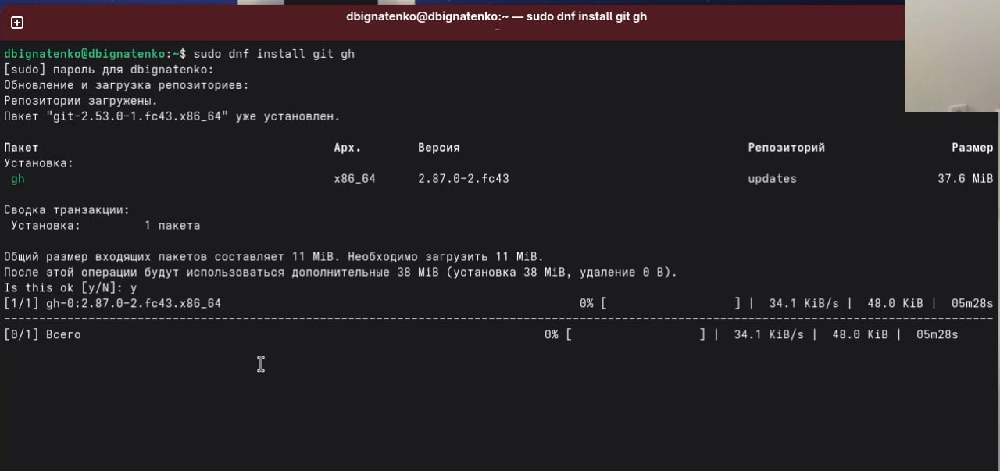
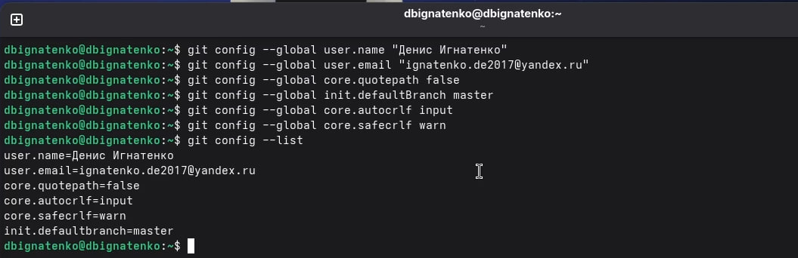
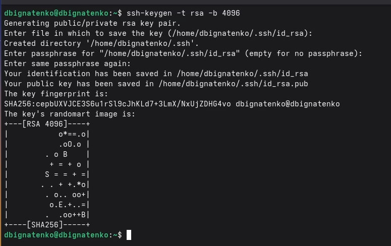
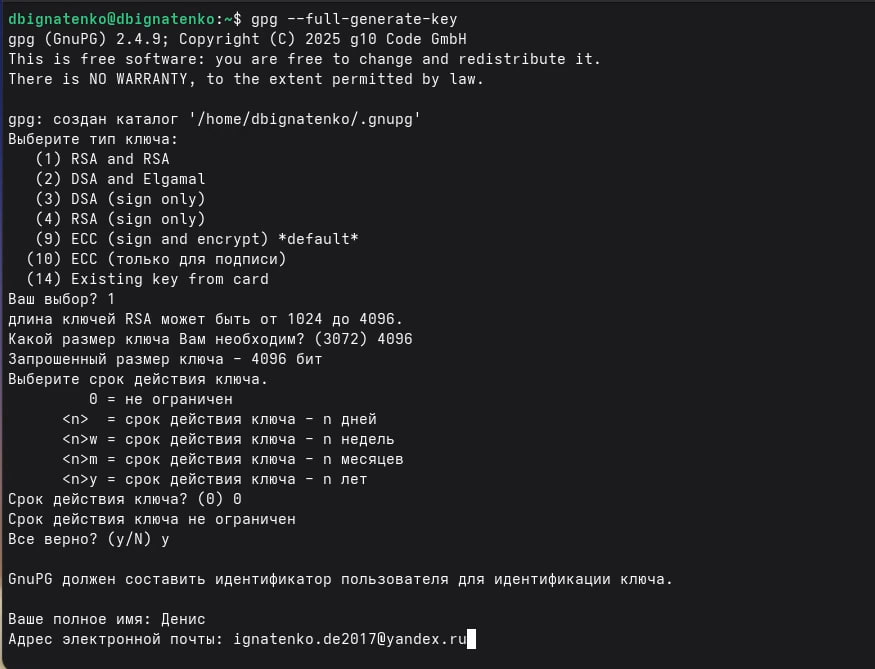
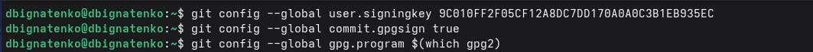
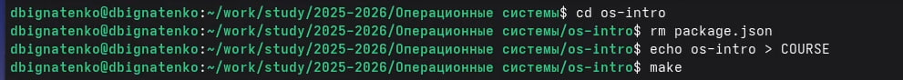

---
## Front matter
lang: ru-RU
title: Лабораторная работа №2
subtitle: Операционные системы
author:
  - Игнатенко Д. Б.
institute:
  - Российский университет дружбы народов, Москва, Россия
date: 03 марта 2026

## i18n babel
babel-lang: russian
babel-otherlangs: english

## Formatting pdf
toc: false
toc-title: Содержание
slide_level: 2
aspectratio: 169
section-titles: true
theme: metropolis
header-includes:
 - \metroset{progressbar=frametitle,sectionpage=progressbar,numbering=fraction}
---

# Информация

## Докладчик

:::::::::::::: {.columns align=center}
::: {.column width="70%"}

  * Игнатенко Денис Беньяминович
  * Студент группы НПИбд-01-25
  * Российский университет дружбы народов
  * [1032252476@rudn.ru](mailto:1032252476@rudn.ru)

:::
::: {.column width="30%"}

:::
::::::::::::::

# Цель работы

Изучить идеологию и применение средств контроля версий. Освоить умения по работе с git.

# Задание

- Создать базовую конфигурацию для работы с git
- Создать ключ SSH
- Создать ключ PGP
- Настроить подписи git
- Зарегистрироваться на Github
- Создать локальный каталог для выполнения заданий по предмету

# Выполнение лабораторной работы

## Установка git и gh

Устанавливаю git и gh (GitHub CLI) с помощью пакетного менеджера dnf.

{#fig:001 width=60%}

## Проверка версий

Проверяю корректность установки командами git --version и gh --version.

{#fig:002 width=70%}

## Базовая настройка git

Выполняю базовую настройку: имя, email, utf-8, ветка master, параметры autocrlf и safecrlf.

{#fig:003 width=70%}

## Создание SSH ключей

Генерирую SSH ключи по алгоритмам RSA (4096 бит) и Ed25519.

{#fig:004 width=60%}

## Генерация Ed25519 ключа

{#fig:005 width=70%}

## Добавление SSH ключа на GitHub

Добавляю публичный ключ ed25519 в настройках GitHub.

{#fig:006 width=60%}

## Создание PGP ключа

Генерирую PGP ключ: тип RSA and RSA, размер 4096 бит.

{#fig:007 width=55%}

## Просмотр PGP ключей

Просматриваю список секретных ключей и копирую fingerprint.

{#fig:008 width=70%}

## Добавление GPG ключа на GitHub

Добавляю экспортированный GPG ключ в настройках GitHub.

{#fig:009 width=60%}

## Настройка автоподписи коммитов

Настраиваю git для автоматической подписи коммитов.

{#fig:010 width=70%}

## Авторизация gh

Авторизуюсь в GitHub CLI через браузер.

{#fig:011 width=60%}

## Создание репозитория курса

Создаю репозиторий на основе шаблона yamadharma/course-directory-student-template.

{#fig:012 width=70%}

## Клонирование репозитория

Клонирую созданный репозиторий с помощью git clone --recursive.

{#fig:013 width=70%}

## Настройка каталога курса

Настраиваю каталог курса и запускаю make.

{#fig:014 width=70%}

## Репозиторий на GitHub

Проверяю, что репозиторий успешно создан на GitHub.

{#fig:015 width=60%}

# Выводы

В ходе выполнения лабораторной работы изучил идеологию и применение средств контроля версий. Освоил базовую настройку git, создание SSH и PGP ключей, настройку подписей коммитов. Настроил GitHub CLI и создал репозиторий курса.
