---
## Front matter
title: "Лабораторная работа №2. Первоначальная настройка git"
subtitle: "Дисциплина: Архитектура компьютеров и операционные системы"
author: "Игнатенко Денис Беньяминович"

## Generic otions
lang: ru-RU
toc-title: "Содержание"

## Bibliography
bibliography: bib/cite.bib
csl: pandoc/csl/gost-r-7-0-5-2008-numeric.csl

## Pdf output format
toc: true
toc-depth: 2
lof: true
lot: true
fontsize: 12pt
linestretch: 1.5
papersize: a4
documentclass: scrreprt
## I18n polyglossia
polyglossia-lang:
  name: russian
  options:
	- spelling=modern
	- babelshorthands=true
polyglossia-otherlangs:
  name: english
## I18n babel
babel-lang: russian
babel-otherlangs: english
## Fonts
mainfont: IBM Plex Serif
romanfont: IBM Plex Serif
sansfont: IBM Plex Sans
monofont: IBM Plex Mono
mathfont: STIX Two Math
mainfontoptions: Ligatures=Common,Ligatures=TeX,Scale=0.94
romanfontoptions: Ligatures=Common,Ligatures=TeX,Scale=0.94
sansfontoptions: Ligatures=Common,Ligatures=TeX,Scale=MatchLowercase,Scale=0.94
monofontoptions: Scale=MatchLowercase,Scale=0.94,FakeStretch=0.9
mathfontoptions:
## Biblatex
biblatex: true
biblio-style: "gost-numeric"
biblatexoptions:
  - parentracker=true
  - backend=biber
  - hyperref=auto
  - language=auto
  - autolang=other*
  - citestyle=gost-numeric
## Pandoc-crossref LaTeX customization
figureTitle: "Рис."
tableTitle: "Таблица"
listingTitle: "Листинг"
lofTitle: "Список иллюстраций"
lotTitle: "Список таблиц"
lolTitle: "Листинги"
## Misc options
indent: true
header-includes:
  - \usepackage{indentfirst}
  - \usepackage{float} # keep figures where there are in the text
  - \floatplacement{figure}{H} # keep figures where there are in the text
---

# Цель работы

Изучить идеологию и применение средств контроля версий. Освоить умения по работе с git.

# Задание

- Создать базовую конфигурацию для работы с git
- Создать ключ SSH
- Создать ключ PGP
- Настроить подписи git
- Зарегистрироваться на Github
- Создать локальный каталог для выполнения заданий по предмету

# Теоретическое введение

Системы контроля версий (Version Control System, VCS) применяются при работе нескольких человек над одним проектом. Обычно основное дерево проекта хранится в локальном или удалённом репозитории, к которому настроен доступ для участников проекта. При внесении изменений в содержание проекта система контроля версий позволяет их фиксировать, совмещать изменения, произведённые разными участниками проекта, производить откат к любой более ранней версии проекта, если это требуется.

Git — распределённая система контроля версий. В отличие от классических систем, в распределённых VCS центральный репозиторий не является обязательным — каждый разработчик имеет полную копию репозитория локально.

Основные команды git представлены в таблице [-@tbl:git-commands].

: Основные команды git {#tbl:git-commands}

| Команда | Описание |
|---------|----------|
| `git init` | Инициализация репозитория |
| `git clone <url>` | Клонирование репозитория |
| `git add .` | Добавить все изменения в индекс |
| `git commit -m "msg"` | Зафиксировать изменения |
| `git push` | Отправить на сервер |
| `git pull` | Получить с сервера |
| `git status` | Статус рабочего каталога |
| `git log` | История коммитов |
| `git branch` | Список веток |
| `git checkout -b branch` | Создать и переключиться на ветку |
| `git merge branch` | Слить ветку |

# Выполнение лабораторной работы

## Установка программного обеспечения

Устанавливаю git и gh (GitHub CLI) с помощью пакетного менеджера dnf (рис. -@fig:001).

```bash
sudo dnf install git gh
```

{#fig:001 width=70%}

Проверяю корректность установки, выводя версии установленных программ (рис. -@fig:002).

```bash
git --version
gh --version
```

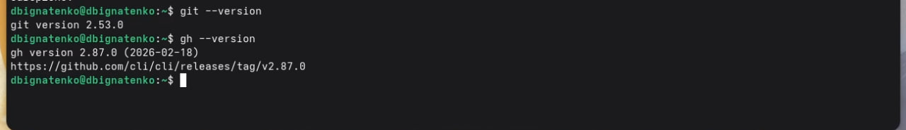{#fig:002 width=70%}

## Базовая настройка git

Выполняю базовую настройку git: задаю имя и email владельца репозитория, настраиваю utf-8 в выводе сообщений, задаю имя начальной ветки master, настраиваю параметры autocrlf и safecrlf (рис. -@fig:003).

Команды настройки git config представлены в таблице [-@tbl:git-config].

: Команды настройки git config {#tbl:git-config}

| Команда | Описание |
|---------|----------|
| `git config --global user.name` | Имя пользователя |
| `git config --global user.email` | Email пользователя |
| `git config --global core.quotepath false` | UTF-8 в выводе |
| `git config --global init.defaultBranch master` | Имя ветки по умолчанию |
| `git config --global core.autocrlf input` | Конвертация CRLF→LF |
| `git config --global core.safecrlf warn` | Предупреждение о конвертации |
| `git config --global user.signingkey` | Ключ для подписи |
| `git config --global commit.gpgsign true` | Автоподпись коммитов |

```bash
git config --global user.name "Денис Игнатенко"
git config --global user.email "ignatenko.de2017@yandex.ru"
git config --global core.quotepath false
git config --global init.defaultBranch master
git config --global core.autocrlf input
git config --global core.safecrlf warn
git config --list
```

{#fig:003 width=70%}

## Создание ключей SSH

Создаю SSH ключ по алгоритму RSA с размером 4096 бит (рис. -@fig:004).

```bash
ssh-keygen -t rsa -b 4096
```

{#fig:004 width=70%}

Создаю SSH ключ по алгоритму Ed25519 (рис. -@fig:005).

```bash
ssh-keygen -t ed25519
```

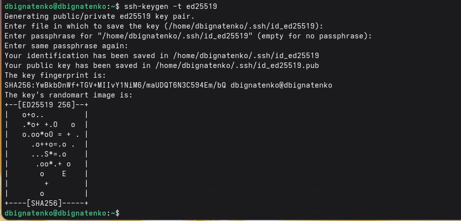{#fig:005 width=70%}

Проверяю, что ключи созданы (рис. -@fig:006).

```bash
ls ~/.ssh/
```

{#fig:006 width=70%}

Вывожу публичный ключ ed25519 для добавления на GitHub (рис. -@fig:007).

```bash
cat ~/.ssh/id_ed25519.pub
```

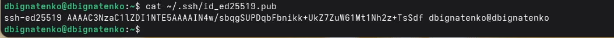{#fig:007 width=70%}

## Добавление SSH ключа на GitHub

Перехожу в настройки GitHub (Settings → SSH and GPG keys), нажимаю «New SSH key», добавляю ключ с названием «LabKey» (рис. -@fig:008).

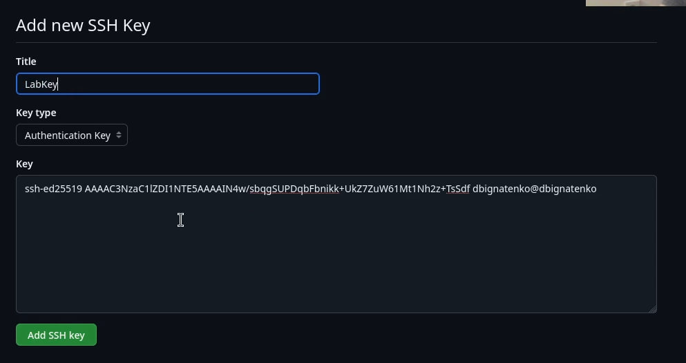{#fig:008 width=70%}

## Создание ключа PGP

Генерирую PGP ключ командой gpg --full-generate-key. Выбираю тип RSA and RSA, размер 4096 бит, срок действия 0 (не истекает). Ввожу имя и email (рис. -@fig:009).

Команды SSH и GPG представлены в таблице [-@tbl:ssh-gpg].

: Команды SSH и GPG {#tbl:ssh-gpg}

| Команда | Описание |
|---------|----------|
| `ssh-keygen -t rsa -b 4096` | Генерация RSA ключа 4096 бит |
| `ssh-keygen -t ed25519` | Генерация Ed25519 ключа |
| `cat ~/.ssh/id_ed25519.pub` | Вывод публичного ключа |
| `gpg --full-generate-key` | Генерация PGP ключа |
| `gpg --list-secret-keys --keyid-format LONG` | Список секретных ключей |
| `gpg --armor --export <fingerprint>` | Экспорт PGP ключа |
| `gh auth login` | Авторизация GitHub CLI |
| `gh auth status` | Проверка статуса авторизации |
| `gh repo create` | Создание репозитория |

```bash
gpg --full-generate-key
```

{#fig:009 width=70%}

Просматриваю список секретных ключей и копирую fingerprint (рис. -@fig:010).

```bash
gpg --list-secret-keys --keyid-format LONG
```

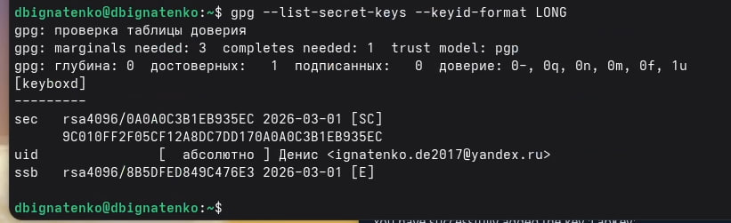{#fig:010 width=70%}

Экспортирую ключ в формате ASCII для добавления на GitHub (рис. -@fig:011).

```bash
gpg --armor --export 9C010FF2F05CF12A8DC7DD170A0A0C3B1EB935EC
```

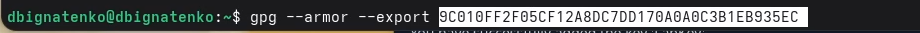{#fig:011 width=70%}

## Добавление PGP ключа на GitHub

Перехожу в настройки GitHub (Settings → SSH and GPG keys → New GPG key), вставляю экспортированный ключ (рис. -@fig:012).

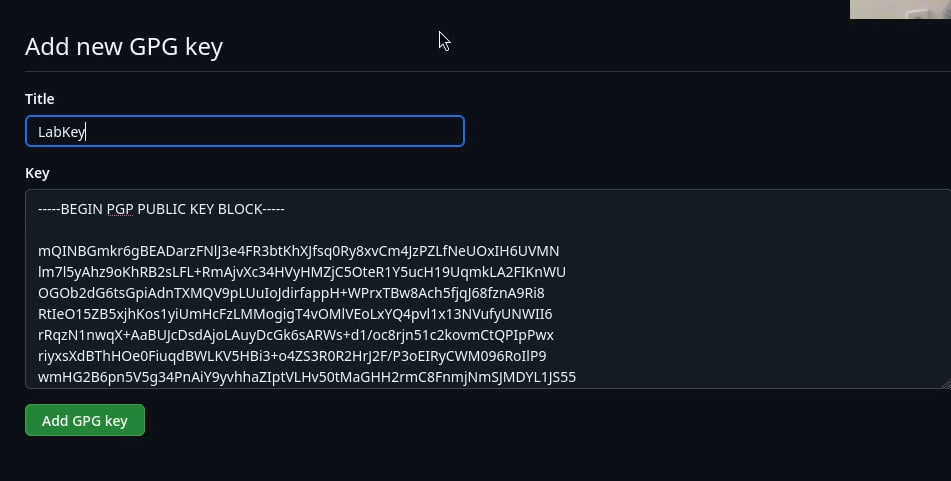{#fig:012 width=70%}

## Настройка автоматических подписей коммитов

Настраиваю git для автоматической подписи коммитов с использованием созданного PGP ключа (рис. -@fig:013).

```bash
git config --global user.signingkey 9C010FF2F05CF12A8DC7DD170A0A0C3B1EB935EC
git config --global commit.gpgsign true
git config --global gpg.program $(which gpg2)
```

{#fig:013 width=70%}

## Настройка gh (GitHub CLI)

Авторизуюсь в GitHub CLI и проверяю статус авторизации (рис. -@fig:014).

```bash
gh auth login
gh auth status
```

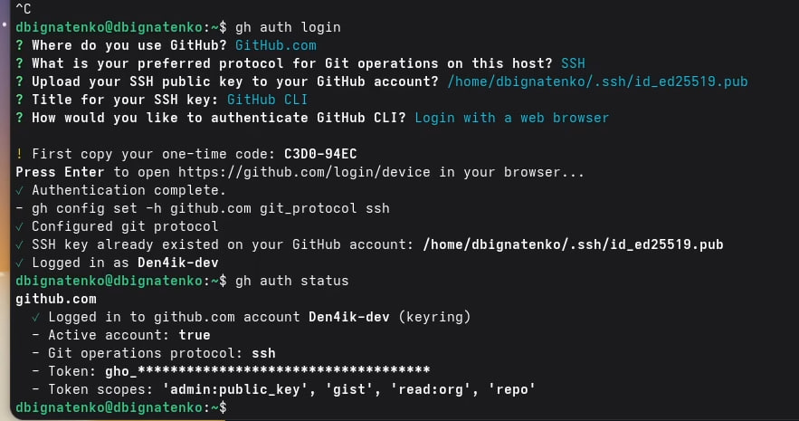{#fig:014 width=70%}

## Создание репозитория курса

Создаю каталог для хранения репозитория курса (рис. -@fig:015).

```bash
mkdir -p ~/work/study/2022-2023/"Операционные системы"
cd ~/work/study/2022-2023/"Операционные системы"
```

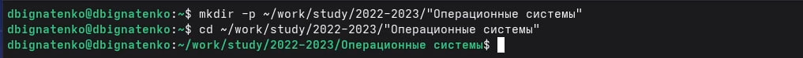{#fig:015 width=70%}

Создаю репозиторий на основе шаблона yamadharma/course-directory-student-template (рис. -@fig:016).

```bash
gh repo create study_2025-2026_os-intro \
  --template=yamadharma/course-directory-student-template \
  --public
```

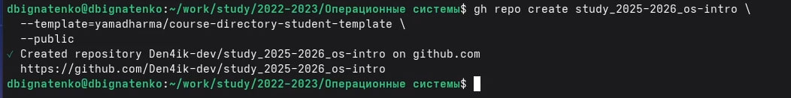{#fig:016 width=70%}

Клонирую созданный репозиторий (рис. -@fig:017).

```bash
git clone --recursive git@github.com:Den4ik-dev/study_2025-2026_os-intro.git os-intro
```

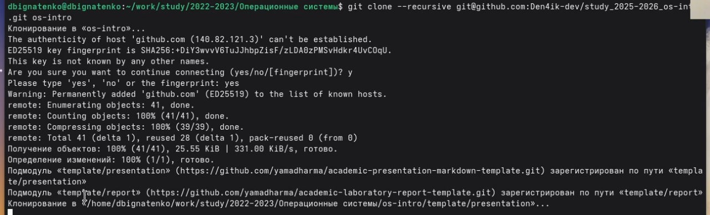{#fig:017 width=70%}

Настраиваю каталог курса: удаляю лишние файлы, создаю файл COURSE и запускаю make (рис. -@fig:018).

```bash
cd os-intro
rm package.json
echo os-intro > COURSE
make
```

{#fig:018 width=70%}

Проверяю, что репозиторий успешно создан на GitHub (рис. -@fig:019).

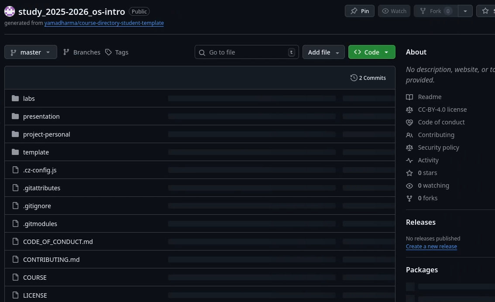{#fig:019 width=70%}

# Ответы на контрольные вопросы

**1. Что такое системы контроля версий (VCS)?**

VCS — программный инструмент для отслеживания изменений в файлах проекта. Позволяет фиксировать изменения, возвращаться к предыдущим версиям, работать нескольким разработчикам над одним проектом без конфликтов.

**2. Хранилище, commit, история, рабочая копия:**

- **Хранилище (репозиторий)** — место где хранятся все версии файлов и история изменений
- **Commit** — зафиксированный снимок состояния файлов в определённый момент с описанием изменений
- **История** — последовательность всех коммитов с указанием автора, даты и описания
- **Рабочая копия** — текущее состояние файлов на локальном компьютере, с которым работает разработчик

**3. Централизованные и децентрализованные VCS:**

- **Централизованные** — единый сервер хранит все версии, разработчики получают рабочую копию с него. Примеры: CVS, Subversion (SVN)
- **Децентрализованные** — каждый разработчик имеет полную копию репозитория локально. Примеры: Git, Mercurial

**4. Единоличная работа с VCS:**

```bash
git init        # создать репозиторий
git add .       # добавить файлы
git commit -m "message"  # зафиксировать изменения
git log         # просмотреть историю
```

**5. Работа с общим хранилищем:**

```bash
git pull        # получить изменения с сервера
# внести изменения в файлы
git add .
git commit -m "message"
git push        # отправить изменения на сервер
```

**6. Основные задачи git:**

Отслеживание изменений файлов, ведение истории версий, работа с ветками, слияние изменений от разных разработчиков, откат к предыдущим версиям.

**7. Команды git:**

См. таблицу [-@tbl:git-commands] в разделе «Теоретическое введение».

**8. Примеры работы с репозиторием:**

Локальный:

```bash
git init
echo "hello" > file.txt
git add file.txt
git commit -m "first commit"
```

Удалённый:

```bash
git remote add origin git@github.com:user/repo.git
git push -u origin master
git pull
```

**9. Зачем нужны ветки (branches):**

Ветки позволяют разрабатывать новую функциональность или исправлять баги изолированно от основного кода. После завершения работы ветка сливается с основной. Это предотвращает попадание незаконченного кода в рабочую версию.

**10. Игнорирование файлов при commit:**

Создаётся файл `.gitignore` в корне репозитория, в котором перечисляются шаблоны файлов которые не нужно отслеживать:

```
*.log
*.tmp
node_modules/
build/
```

Это нужно чтобы временные файлы, скомпилированные артефакты и конфиденциальные данные не попадали в репозиторий.

# Выводы

В ходе выполнения лабораторной работы изучил идеологию и применение средств контроля версий. Освоил базовую настройку git, создание SSH и PGP ключей, настройку подписей коммитов. Настроил GitHub CLI (gh) для удобной работы с GitHub из командной строки. Создал репозиторий курса на основе шаблона и настроил его для дальнейшей работы.

# Список литературы{.unnumbered}

::: {#refs}
:::
