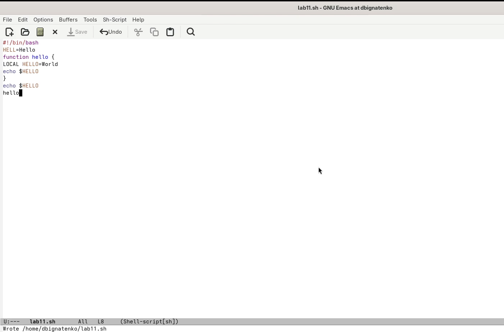
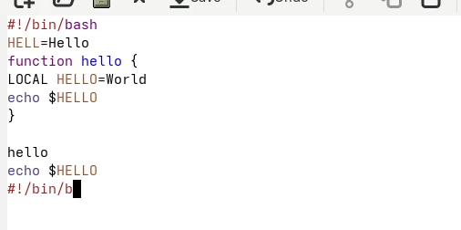
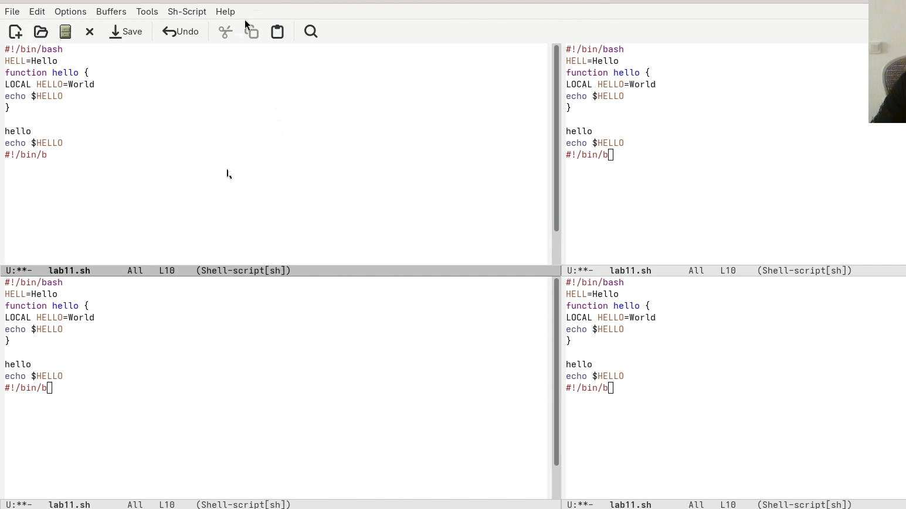
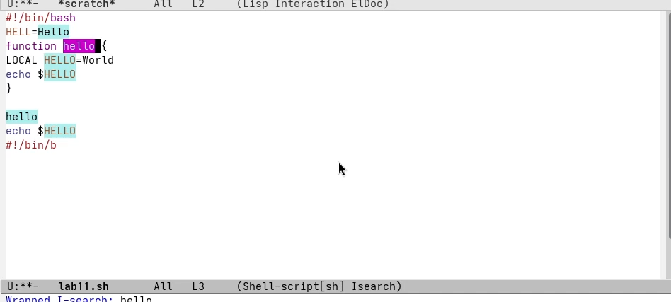

---
## Front matter
lang: ru-RU
title: Лабораторная работа №11
subtitle: Текстовый редактор Emacs
author:
  - Игнатенко Д. Б.
institute:
  - Российский университет дружбы народов, Москва, Россия
date: 25 апреля 2026

## i18n babel
babel-lang: russian
babel-otherlangs: english

## Formatting pdf
toc: false
toc-title: Содержание
slide_level: 2
aspectratio: 169
section-titles: true
theme: metropolis
header-includes:
 - \metroset{progressbar=frametitle,sectionpage=progressbar,numbering=fraction}
---

# Информация

## Докладчик

:::::::::::::: {.columns align=center}
::: {.column width="70%"}

  * Игнатенко Денис Беньяминович
  * Студент группы НПИбд-01-25
  * Российский университет дружбы народов
  * [1032252476@rudn.ru](mailto:1032252476@rudn.ru)

:::
::: {.column width="30%"}

:::
::::::::::::::

# Цель работы

Познакомиться с операционной системой Linux и получить практические навыки работы с текстовым редактором `Emacs`.

# Задание

- Запустить `Emacs`
- Создать и сохранить файл `lab11.sh`
- Освоить редактирование текста и перемещение по буферу
- Отработать работу с буферами и окнами
- Выполнить поиск, замену и альтернативный поиск

# Запуск Emacs

Открываю редактор `Emacs` и подготавливаю рабочую среду для выполнения лабораторной работы.

{width=68%}

# Создание файла `lab11.sh`

С помощью `C-x C-f` создаю новый файл `lab11.sh`.

{width=68%}

# Ввод и сохранение текста

Ввожу исходный текст программы и сохраняю файл командой `C-x C-s`.

{width=58%}

{width=58%}

# Редактирование текста

Отрабатываю команды `C-k`, `C-y`, `C-space`, `M-w`, `C-w`, `C-/`.

{width=62%}

# Перемещение по буферу

Проверяю команды `C-a`, `C-e`, `M-<`, `M->` для переходов по строке и буферу.

{width=48%}

{width=48%}

# Работа с буферами

Использую `C-x C-b` для просмотра списка буферов и `C-x b` для переключения между ними.

{width=72%}

{width=72%}

# Работа с окнами

Разделяю фрейм на четыре окна и открываю в них разные буферы.

{width=76%}

{width=76%}

# Поиск и замена

Выполняю инкрементный поиск `C-s` и замену `M-%`.

{width=64%}

{width=64%}

{width=64%}

# Альтернативный поиск `M-s o`

Команда `M-s o` выводит все совпадения в отдельный буфер, что удобнее для обзора результата поиска.

{width=76%}

# Выводы

- Освоил базовые команды работы в `Emacs`
- Научился создавать и сохранять файлы
- Отработал редактирование, навигацию, работу с буферами и окнами
- Выполнил поиск, замену и альтернативный поиск по совпадениям
