---
## Front matter
title: "Лабораторная работа №11. Текстовый редактор Emacs"
subtitle: "Дисциплина: Архитектура компьютеров и операционные системы"
author: "Игнатенко Денис Беньяминович"

## Generic otions
lang: ru-RU
toc-title: "Содержание"

## Bibliography
bibliography: bib/cite.bib
csl: pandoc/csl/gost-r-7-0-5-2008-numeric.csl

## Pdf output format
toc: true
toc-depth: 2
lof: true
lot: true
fontsize: 12pt
linestretch: 1.5
papersize: a4
documentclass: scrreprt
## I18n polyglossia
polyglossia-lang:
  name: russian
  options:
    - spelling=modern
    - babelshorthands=true
polyglossia-otherlangs:
  name: english
## I18n babel
babel-lang: russian
babel-otherlangs: english
## Biblatex
biblatex: true
biblio-style: "gost-numeric"
biblatexoptions:
  - parentracker=true
  - backend=biber
  - hyperref=auto
  - language=auto
  - autolang=other*
  - citestyle=gost-numeric
## Pandoc-crossref LaTeX customization
figureTitle: "Рис."
tableTitle: "Таблица"
listingTitle: "Листинг"
lofTitle: "Список иллюстраций"
lotTitle: "Список таблиц"
lolTitle: "Листинги"
## Misc options
indent: true
header-includes:
  - \usepackage{indentfirst}
  - \usepackage{float}
  - \floatplacement{figure}{H}
---

# Цель работы

Познакомиться с операционной системой Linux и получить практические навыки работы с текстовым редактором `Emacs`.

# Задание

- Запустить редактор `Emacs`.
- Создать и сохранить файл `lab11.sh`.
- Ввести в файл текст программы.
- Освоить базовые команды редактирования, перемещения по тексту, работы с буферами и окнами.
- Выполнить поиск, замену и альтернативный поиск по совпадениям.
- Зафиксировать результаты в виде снимков экрана, листинга программы и ответов на контрольные вопросы.

# Теоретическое введение

`Emacs` представляет собой расширяемый экранный текстовый редактор, ориентированный на работу с буферами, окнами и комбинациями клавиш. В ходе лабораторной работы были использованы команды открытия файла, сохранения, удаления и вставки текста, перехода по строке и буферу, а также средства поиска и замены.

Основные команды, использованные в работе, приведены в следующей таблице.

| Команда | Назначение |
|---|---|
| `C-x C-f` | Открыть существующий файл или создать новый |
| `C-x C-s` | Сохранить файл |
| `C-k` | Вырезать текст от курсора до конца строки |
| `C-y` | Вставить последний вырезанный или скопированный фрагмент |
| `C-space` | Начать выделение области |
| `M-w` | Скопировать выделенную область |
| `C-w` | Вырезать выделенную область |
| `C-/` | Отменить последнее действие |
| `C-a` | Перейти в начало строки |
| `C-e` | Перейти в конец строки |
| `M-<` | Перейти в начало буфера |
| `M->` | Перейти в конец буфера |
| `C-x C-b` | Показать список буферов |
| `C-x b` | Переключиться на другой буфер |
| `C-x o` | Переключиться в другое окно |
| `C-x 0` | Закрыть текущее окно |
| `C-x 2`, `C-x 3` | Разделить окно по горизонтали и вертикали |
| `C-s` | Инкрементный поиск |
| `M-%` | Поиск и замена |
| `M-s o` | Вывод всех совпадений в отдельный буфер |

# Выполнение лабораторной работы

## Запуск Emacs

Запускаю текстовый редактор `Emacs` и проверяю его стартовое окно.

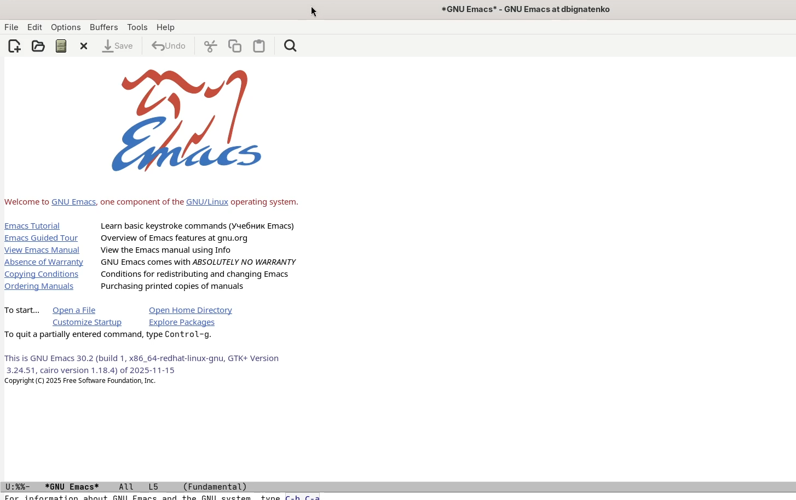{#fig:001 width=70%}

## Создание файла `lab11.sh`

С помощью сочетания клавиш `C-x C-f` создаю новый файл `lab11.sh`. В данной лабораторной работе использовался именно файл `lab11.sh`, а не `lab07.sh`.

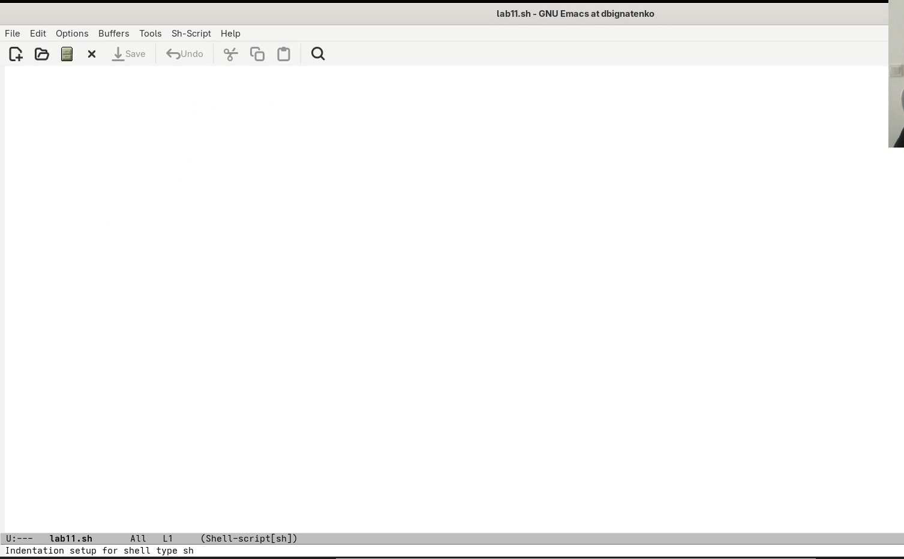{#fig:002 width=70%}

## Ввод и сохранение исходного текста

Ввожу текст программы в новый файл. Исходный вариант соответствует заданию и используется далее для отработки команд редактирования.

```bash
#!/bin/bash
HELL=Hello
function hello {
LOCAL HELLO=World
echo $HELLO
}
echo $HELLO
hello
```

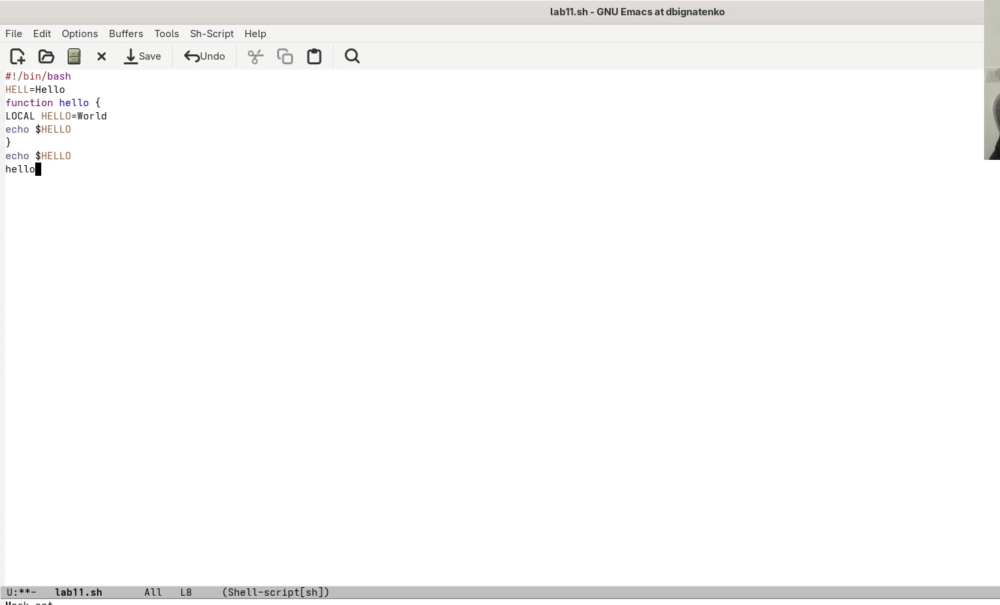{#fig:003 width=70%}

После ввода сохраняю файл командой `C-x C-s`.

{#fig:004 width=70%}

## Редактирование текста

Далее отрабатываю команды редактирования текста: удаление до конца строки `C-k`, вставку `C-y`, выделение области `C-space`, копирование `M-w`, вырезание области `C-w` и отмену последнего действия `C-/`. В результате в конце файла временно появляется продублированная строка `echo $HELLO`, что подтверждает успешное применение операций копирования и вставки.

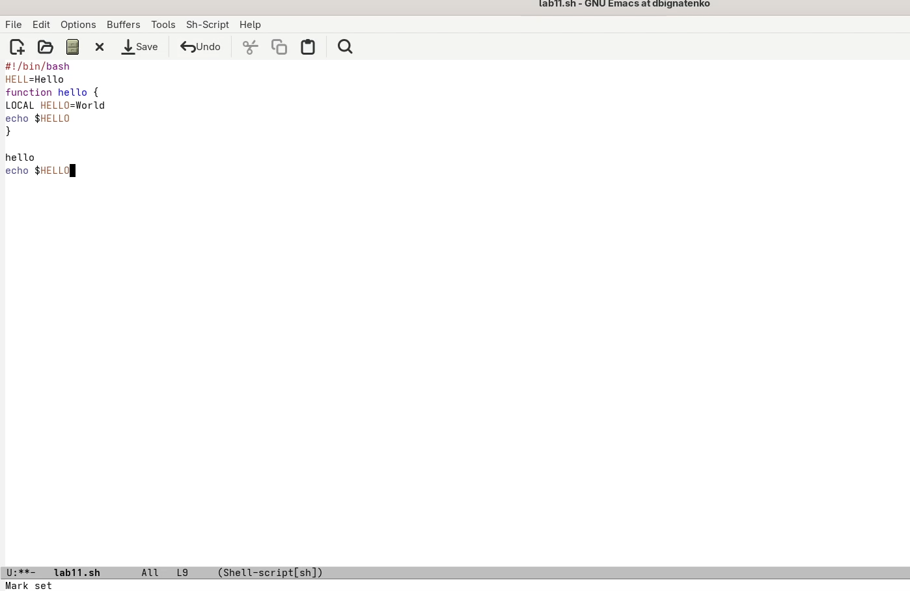{#fig:005 width=70%}

На следующем снимке видно позиционирование курсора внутри редактируемого текста после выполнения команд выделения и перемещения по строкам.

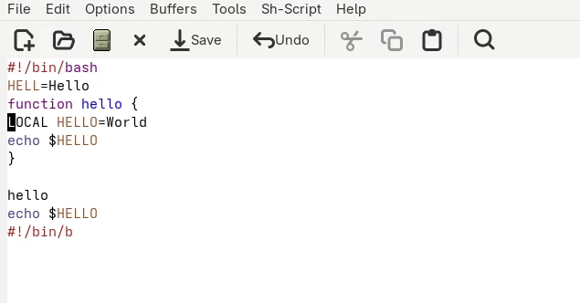{#fig:006 width=60%}

## Перемещение по строке и буферу

Проверяю команды перемещения `C-a`, `C-e`, `M-<` и `M->`. На снимках экрана последовательно зафиксированы переходы к началу файла и к концу буфера.

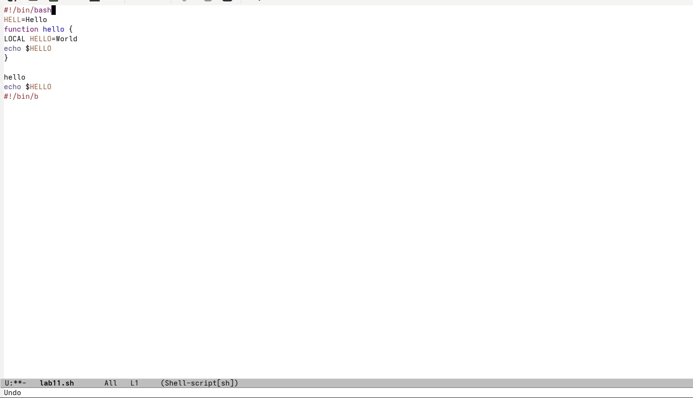{#fig:007 width=60%}

{#fig:008 width=60%}

## Работа с буферами

С помощью команды `C-x C-b` вывожу список доступных буферов. В списке присутствуют буферы `lab11.sh`, `*GNU Emacs*`, `*scratch*` и `*Messages*`.

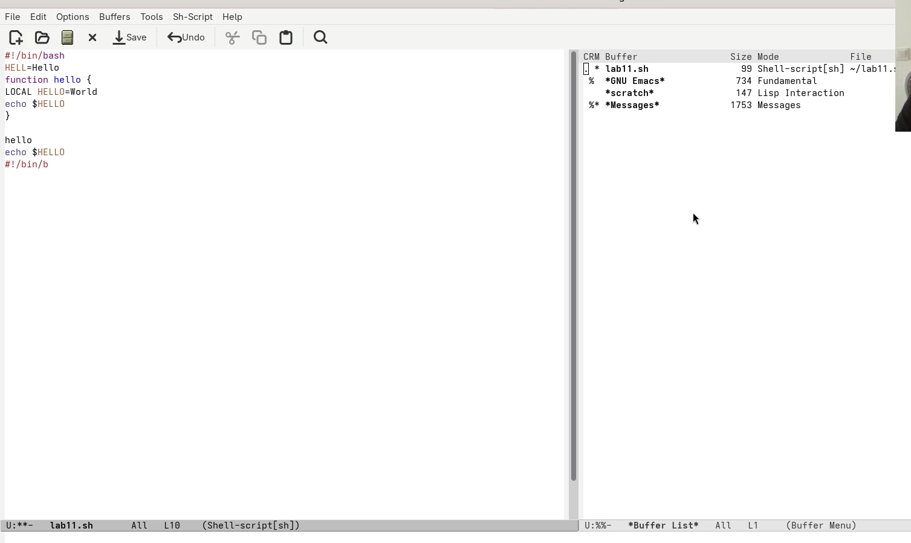{#fig:009 width=70%}

Затем перехожу в другой буфер и возвращаюсь к рабочему сеансу редактора.

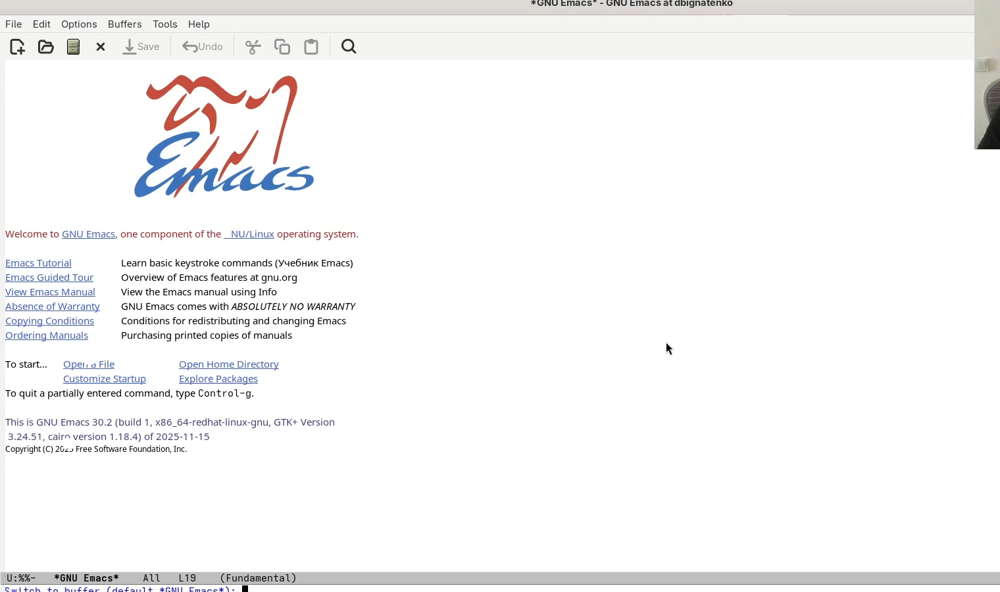{#fig:010 width=70%}

## Работа с окнами

С помощью команд `C-x 3`, `C-x 2` и `C-x o` делю рабочее пространство на четыре окна.

{#fig:011 width=80%}

После этого в отдельных окнах открываю разные буферы и ввожу дополнительный текст для проверки переключения между окнами и буферами.

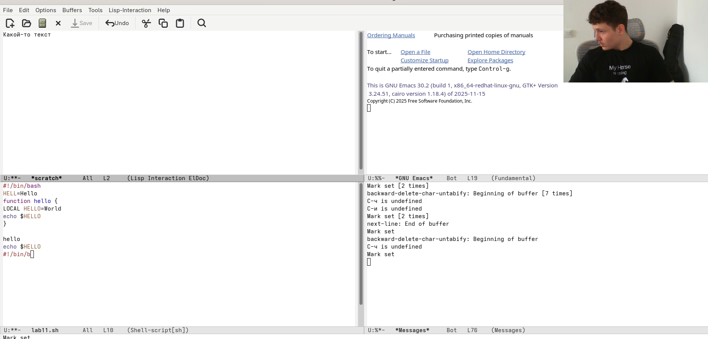{#fig:012 width=80%}

## Поиск текста

Выполняю инкрементный поиск командой `C-s`. Совпадения подсвечиваются прямо в текущем буфере.

{#fig:013 width=70%}

## Поиск и замена

Для замены текста использую команду `M-%`. В качестве примера выполняю замену `HELLO` на `HELLO_NEW`.

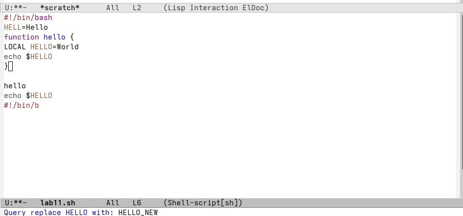{#fig:014 width=70%}

После подтверждения замены получаю обновлённый результат в тексте файла.

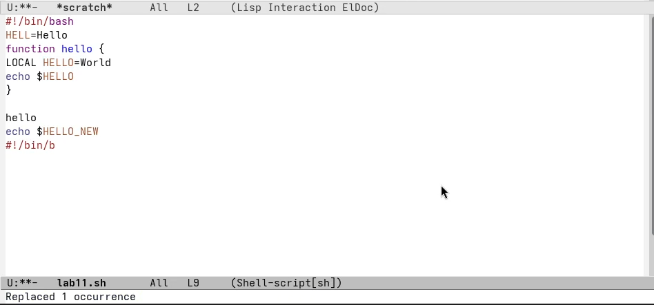{#fig:015 width=70%}

## Альтернативный поиск `M-s o`

Дополнительно проверяю альтернативный поиск `M-s o`. В отличие от `C-s`, эта команда формирует отдельный буфер со списком всех найденных совпадений.

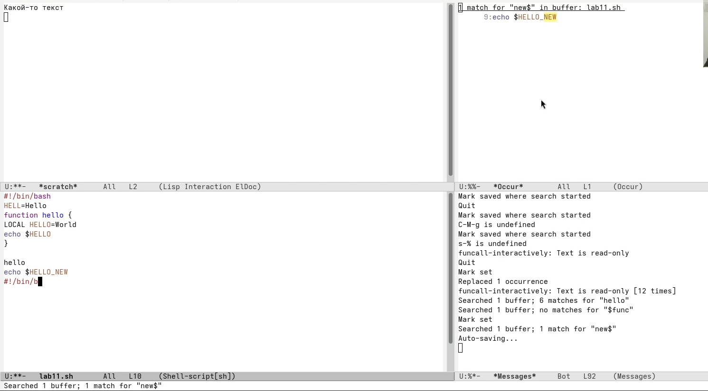{#fig:016 width=80%}

# Ответы на контрольные вопросы

**1. Что такое буфер в Emacs?**

Буфер в `Emacs` — это область памяти, в которой хранится текст редактируемого файла или служебная информация. Один буфер может быть связан с файлом на диске, а другой может быть служебным, например `*Messages*` или `*scratch*`.

**2. Чем отличаются окно и фрейм в Emacs?**

Фрейм — это отдельное графическое окно приложения `Emacs`. Окно в терминологии `Emacs` — это часть фрейма, в которой отображается конкретный буфер. Один фрейм можно разделить на несколько окон.

**3. Какие комбинации клавиш используются для открытия и сохранения файла?**

Для открытия или создания файла используется `C-x C-f`, а для сохранения текущего буфера в файл — `C-x C-s`.

**4. Как в Emacs выполняются копирование, вырезание и вставка текста?**

Выделение начинается командой `C-space`. Скопировать выделенную область можно командой `M-w`, вырезать — `C-w`, а вставить последний скопированный или вырезанный фрагмент — `C-y`.

**5. Как перейти в начало и конец строки и всего буфера?**

Переход в начало строки выполняется командой `C-a`, в конец строки — `C-e`, в начало буфера — `M-<`, в конец буфера — `M->`.

**6. Как выполняются поиск и замена текста?**

Инкрементный поиск запускается командой `C-s`: вводимый шаблон сразу ищется по тексту. Поиск и замена выполняются командой `M-%`, после чего задаются искомая строка, строка замены и подтверждение для каждой замены либо сразу для всех.

**7. Чем отличается команда `M-s o` от обычного поиска `C-s`?**

`C-s` последовательно перемещает курсор по совпадениям в текущем буфере. Команда `M-s o` собирает все найденные совпадения и выводит их в отдельном буфере, что удобно для обзора результатов поиска.

# Выводы

В ходе выполнения лабораторной работы были получены практические навыки работы с текстовым редактором `Emacs` в среде Linux. Были изучены команды создания и сохранения файлов, редактирования текста, перемещения по буферу, работы с буферами и окнами, а также поиска и замены текста. Дополнительно был опробован альтернативный поиск `M-s o`, выводящий все совпадения в отдельный буфер.

# Список литературы{.unnumbered}

::: {#refs}
:::
