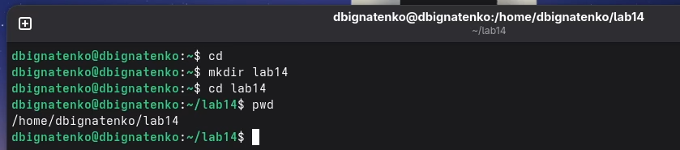
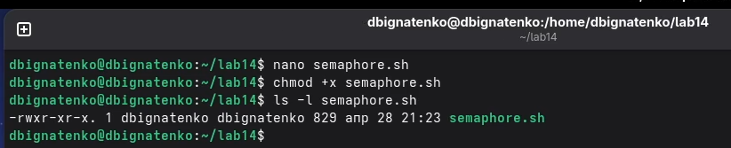
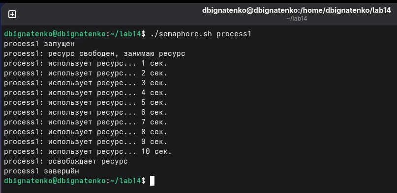
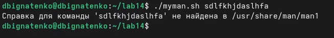
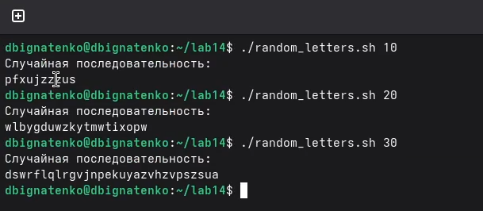
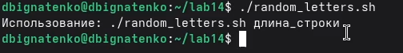

---
## Front matter
lang: ru-RU
title: Лабораторная работа №14
subtitle: Операционные системы
author:
  - Игнатенко Д. Б.
institute:
  - Российский университет дружбы народов, Москва, Россия
date: 15 мая 2026

## i18n babel
babel-lang: russian
babel-otherlangs: english

## Formatting pdf
toc: false
toc-title: Содержание
slide_level: 2
aspectratio: 169
section-titles: true
theme: metropolis
fonttheme: professionalfonts
header-includes:
 - \metroset{progressbar=frametitle,sectionpage=progressbar,numbering=fraction}
 - \usepackage{fontspec}
 - \setsansfont{Arial}
 - \setmainfont{Arial}
 - \setmonofont{Courier New}
---

# Информация

## Докладчик

:::::::::::::: {.columns align=center}
::: {.column width="70%"}

  * Игнатенко Денис Беньяминович
  * Студент группы НПИбд-01-25
  * Российский университет дружбы народов
  * [1032252476@rudn.ru](mailto:1032252476@rudn.ru)

:::
::: {.column width="30%"}

:::
::::::::::::::

# Цель работы

Изучить основы программирования в оболочке ОС UNIX и освоить написание командных файлов с использованием условий, циклов и аргументов командной строки.

# Задание

- Реализовать упрощённый механизм семафоров.
- Реализовать аналог команды `man`.
- Создать генератор случайной последовательности латинских букв.

# Выполнение лабораторной работы

## Подготовка рабочего каталога

Создал каталог `lab14`, перешёл в него и проверил текущий путь.

{#fig:001 width=62%}

## Скрипт `semaphore.sh`

Создал файл `semaphore.sh`, выдал права на выполнение и проверил их командой `ls -l`.

{#fig:002 width=62%}

## Проверка `semaphore.sh` на одном процессе

При одиночном запуске процесс сразу захватывает ресурс, использует его и затем освобождает.

{#fig:003 width=70%}

## Проверка `semaphore.sh` на двух и трёх процессах

- При двух процессах один удерживает ресурс, второй ожидает освобождения.
- При трёх процессах доступ к ресурсу также остаётся строго последовательным.

{#fig:004 width=78%}

## Проверка `semaphore.sh` на трёх процессах

{#fig:005 width=74%}

## Скрипт `myman.sh`

Предварительно просмотрел содержимое каталога `/usr/share/man/man1`, затем подготовил скрипт `myman.sh`.

{#fig:006 width=75%}

## Права доступа `myman.sh`

{#fig:007 width=62%}

## Проверка `myman.sh`

- Для команды `ls` скрипт открывает справочную страницу.
- Для строки `sdlfkhjdaslhfa` выводит сообщение об отсутствии справки.

{#fig:008 width=82%}

## Обработка отсутствующей справки

{#fig:009 width=70%}

## Скрипт `random_letters.sh`

Создал файл, выдал права на выполнение и проверил корректность запуска.

{#fig:010 width=62%}

## Генерация случайных строк

Скрипт успешно создаёт строки длиной `10`, `20` и `30` символов из строчных латинских букв.

{#fig:011 width=68%}

## Проверка запуска без аргумента

При отсутствии параметра длины выводится сообщение с форматом вызова.

{#fig:012 width=70%}

# Выводы

В ходе лабораторной работы реализовал три командных файла на `bash`: упрощённый семафор, аналог `man` и генератор случайных строк. Скриншоты подтверждают корректную работу программ как в штатных режимах, так и при обработке ошибочного ввода.
