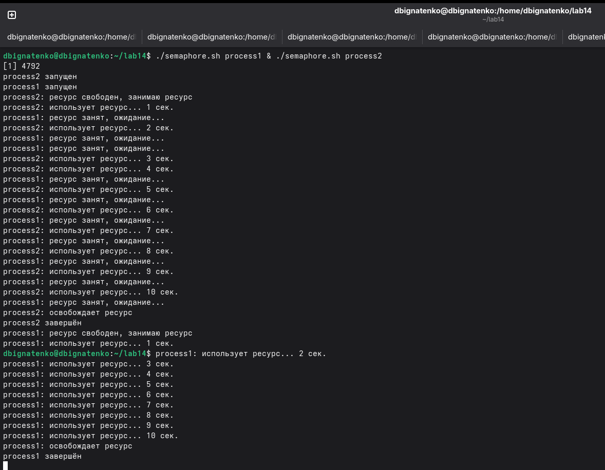
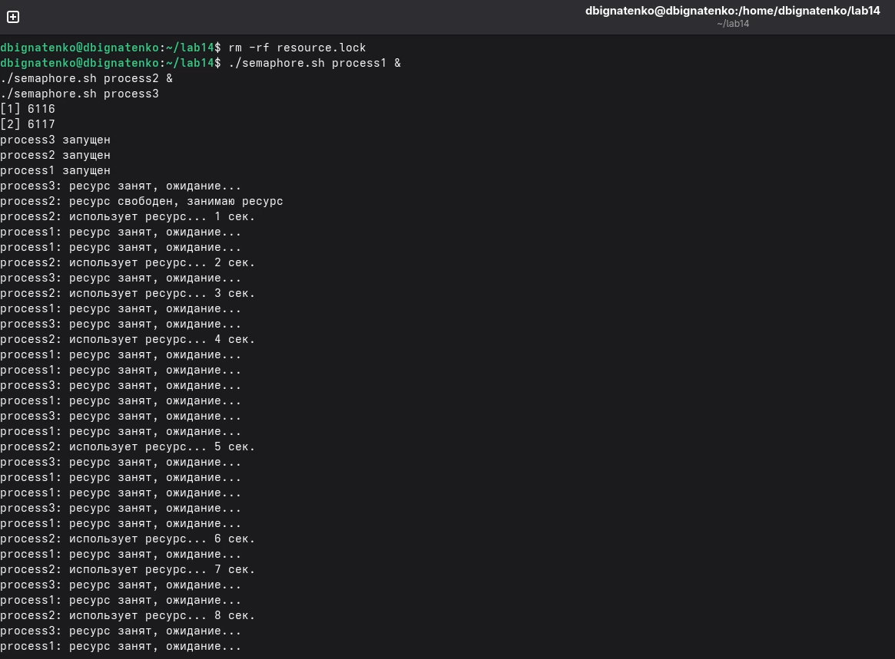
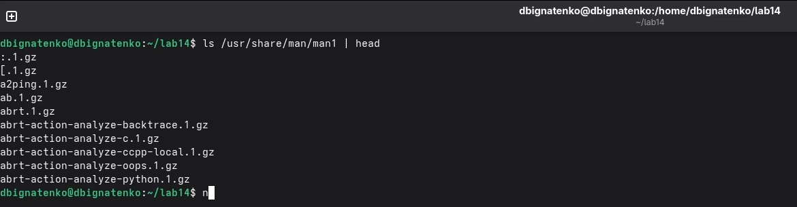
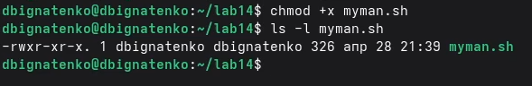
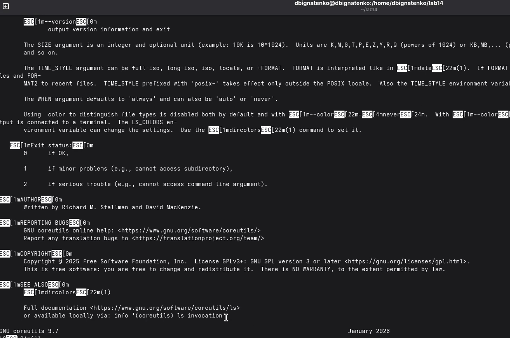
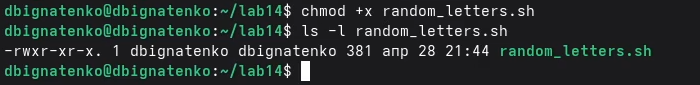

---
## Front matter
title: "Лабораторная работа №14. Программирование в командном процессоре ОС UNIX. Расширенное программирование"
subtitle: "Дисциплина: Архитектура компьютеров и операционные системы"
author: "Игнатенко Денис Беньяминович"

## Generic otions
lang: ru-RU
toc-title: "Содержание"

## Bibliography
bibliography: bib/cite.bib
csl: pandoc/csl/gost-r-7-0-5-2008-numeric.csl

## Pdf output format
toc: true
toc-depth: 2
lof: true
lot: true
fontsize: 12pt
linestretch: 1.5
papersize: a4
documentclass: scrreprt
## I18n polyglossia
polyglossia-lang:
  name: russian
  options:
    - spelling=modern
    - babelshorthands=true
polyglossia-otherlangs:
  name: english
## I18n babel
babel-lang: russian
babel-otherlangs: english
## Fonts
mainfont: Times New Roman
romanfont: Times New Roman
sansfont: Arial
monofont: Consolas
mathfont: Cambria Math
mainfontoptions: Ligatures=Common,Ligatures=TeX,Scale=0.94
romanfontoptions: Ligatures=Common,Ligatures=TeX,Scale=0.94
sansfontoptions: Ligatures=Common,Ligatures=TeX,Scale=MatchLowercase,Scale=0.94
monofontoptions: Scale=MatchLowercase,Scale=0.94,FakeStretch=0.9
mathfontoptions:
## Biblatex
biblatex: true
biblio-style: "gost-numeric"
biblatexoptions:
  - parentracker=true
  - backend=biber
  - hyperref=auto
  - language=auto
  - autolang=other*
  - citestyle=gost-numeric
## Pandoc-crossref LaTeX customization
figureTitle: "Рис."
tableTitle: "Таблица"
listingTitle: "Листинг"
lofTitle: "Список иллюстраций"
lotTitle: "Список таблиц"
lolTitle: "Листинги"
## Misc options
indent: true
header-includes:
  - \usepackage{indentfirst}
  - \usepackage{float}
  - \floatplacement{figure}{H}
---

# Цель работы

Изучить основы программирования в оболочке ОС UNIX и освоить написание более сложных командных файлов с использованием логических управляющих конструкций, циклов и аргументов командной строки.

# Задание

- Написать командный файл, реализующий упрощённый механизм семафоров.
- Реализовать аналог команды `man` с помощью командного файла.
- Разработать командный файл, генерирующий случайную последовательность букв латинского алфавита с использованием переменной `$RANDOM`.

# Теоретическое введение

Командные файлы `bash` удобны для автоматизации типовых действий в UNIX-подобных системах. Они позволяют организовывать ветвления, циклы, обработку аргументов командной строки и взаимодействие с системными утилитами.

В лабораторной работе были реализованы три типовых сценария: синхронизация доступа к ресурсу, обращение к справочной подсистеме и генерация случайных данных. Их краткая характеристика приведена в таблице 1.

: Реализованные командные файлы {#tbl:scripts}

| Файл | Назначение | Основная идея реализации |
|------|------------|--------------------------|
| `semaphore.sh` | Упрощённый семафор | Захват ресурса через атомарное создание каталога `resource.lock` |
| `myman.sh` | Аналог `man` | Поиск архива справки в `/usr/share/man/man1` и открытие найденного файла |
| `random_letters.sh` | Генерация случайной строки | Преобразование значения `$RANDOM` в диапазон кодов букв `a`-`z` |

# Выполнение лабораторной работы

## Подготовка рабочего каталога

В начале работы был создан каталог `lab14`, после чего выполнен переход в него и проверен текущий путь командой `pwd` (рис. 1).

```bash
cd
mkdir lab14
cd lab14
pwd
```

{width=70%}

## Реализация упрощённого механизма семафоров

Сначала был создан и сделан исполняемым файл `semaphore.sh` (рис. 2).

```bash
nano semaphore.sh
chmod +x semaphore.sh
ls -l semaphore.sh
```

{width=70%}

Листинг скрипта:

```bash
#!/bin/bash

LOCKDIR="resource.lock"

T1=15
T2=10

PROCESS_NAME=$1

if [ -z "$PROCESS_NAME" ]; then
    PROCESS_NAME="process_$$"
fi

echo "$PROCESS_NAME запущен"

WAITED=0

while ! mkdir "$LOCKDIR" 2>/dev/null; do
    echo "$PROCESS_NAME: ресурс занят, ожидание..."
    sleep 1
    WAITED=$((WAITED + 1))

    if [ "$WAITED" -ge "$T1" ]; then
        echo "$PROCESS_NAME: время ожидания истекло, ресурс не получен"
        exit 1
    fi
done

trap 'rm -rf "$LOCKDIR"' EXIT

echo "$PROCESS_NAME: ресурс свободен, занимаю ресурс"

for ((i=1; i<=T2; i++)); do
    echo "$PROCESS_NAME: использует ресурс... $i сек."
    sleep 1
done

echo "$PROCESS_NAME: освобождает ресурс"
rm -rf "$LOCKDIR"

trap - EXIT

echo "$PROCESS_NAME завершён"
```

При одиночном запуске процесс сразу получает доступ к ресурсу, удерживает его в течение десяти секунд и затем освобождает (рис. 3).

```bash
./semaphore.sh process1
```

{width=70%}

При одновременном запуске двух процессов один из них занимает ресурс, а второй переходит в режим ожидания до освобождения блокировки (рис. 4). По фактическому выводу на скриншоте первым ресурс захватывает `process2`, а `process1` ожидает.

```bash
./semaphore.sh process1 &
./semaphore.sh process2
```

{width=90%}

Проверка с тремя процессами показывает, что в каждый момент времени ресурс использует только один процесс, а остальные выводят сообщения об ожидании (рис. 5).

```bash
rm -rf resource.lock
./semaphore.sh process1 &
./semaphore.sh process2 &
./semaphore.sh process3
```

{width=85%}

Таким образом, каталог `resource.lock` используется как простая блокировка, а цикл ожидания обеспечивает последовательный доступ нескольких процессов к одному ресурсу.

## Реализация аналога команды man

Перед созданием скрипта был просмотрен каталог `/usr/share/man/man1`, содержащий архивы справочных страниц для пользовательских команд (рис. 6).

```bash
ls /usr/share/man/man1 | head
```

{width=80%}

После этого был создан и сделан исполняемым файл `myman.sh` (рис. 7).

```bash
chmod +x myman.sh
ls -l myman.sh
```

{width=70%}

Листинг скрипта:

```bash
#!/bin/bash

if [ -z "$1" ]; then
    echo "Использование: $0 имя_команды"
    exit 1
fi

COMMAND=$1
MAN_DIR="/usr/share/man/man1"
FILE="$MAN_DIR/$COMMAND.1.gz"

if [ -f "$FILE" ]; then
    less "$FILE"
else
    echo "Справка для команды '$COMMAND' не найдена в $MAN_DIR"
fi
```

При вызове с существующей командой `ls` скрипт открывает содержимое справочной страницы в просмотрщике `less` (рис. 8).

```bash
./myman.sh ls
```

{width=90%}

При обращении к несуществующей команде `sdlfkhjdaslhfa` выводится сообщение об отсутствии файла справки в каталоге `man1` (рис. 9).

```bash
./myman.sh sdlfkhjdaslhfa
```

{width=70%}

Скрипт корректно обрабатывает оба основных сценария: наличие и отсутствие соответствующего man-файла.

## Генерация случайной последовательности букв

Для третьего задания был подготовлен и сделан исполняемым файл `random_letters.sh` (рис. 10).

```bash
chmod +x random_letters.sh
ls -l random_letters.sh
```

{width=70%}

Листинг скрипта:

```bash
#!/bin/bash

if [ -z "$1" ]; then
    echo "Использование: ./random_letters.sh длина_строки"
    exit 1
fi

LENGTH=$1
RESULT=""

for ((i=1; i<=LENGTH; i++)); do
    NUM=$((RANDOM % 26))
    ASCII=$((97 + NUM))
    LETTER=$(printf "\\$(printf '%03o' "$ASCII")")
    RESULT="${RESULT}${LETTER}"
done

echo "Случайная последовательность:"
echo "$RESULT"
```

На скриншоте видно три запуска программы с длинами `10`, `20` и `30`, в результате которых формируются различные строки из строчных латинских букв (рис. 11).

```bash
./random_letters.sh 10
./random_letters.sh 20
./random_letters.sh 30
```

{width=75%}

При запуске без аргумента скрипт выводит подсказку по использованию, что позволяет корректно обработать ошибочный вызов (рис. 12).

```bash
./random_letters.sh
```

{width=70%}

Реализация использует переменную `$RANDOM`, приводит её значение к диапазону от `0` до `25`, а затем преобразует его в ASCII-код строчной латинской буквы.

# Ответы на контрольные вопросы

## 1. Найдите синтаксическую ошибку в строке `while [$1 != "exit"]`

Ошибка состоит в отсутствии пробелов после `[` и перед `]`. Корректная запись:

```bash
while [ "$1" != "exit" ]
```

Дополнительно переменную лучше заключать в кавычки, чтобы избежать ошибок при пустом значении.

## 2. Как объединить несколько строк в одну?

В `bash` строки можно объединять через подстановку переменных:

```bash
a="Hello"
b="World"
c="$a $b"
echo "$c"
```

Также можно постепенно дописывать фрагменты в результирующую строку:

```bash
result=""
result="${result}abc"
result="${result}def"
echo "$result"
```

## 3. Найдите информацию об утилите `seq`. Какими иными способами можно реализовать её функционал при программировании на bash?

Утилита `seq` выводит последовательность чисел в заданном диапазоне. Например:

```bash
seq 1 5
```

Аналогичное поведение можно получить с помощью цикла `for`:

```bash
for ((i=1; i<=5; i++)); do
    echo "$i"
done
```

или цикла `while`:

```bash
i=1
while [ "$i" -le 5 ]; do
    echo "$i"
    i=$((i + 1))
done
```

## 4. Какой результат даст вычисление выражения `$((10/3))`?

Результатом будет число `3`, так как в арифметических выражениях `bash` деление целочисленное.

## 5. Укажите кратко основные отличия командной оболочки `zsh` от `bash`

`zsh` обладает более развитыми средствами интерактивной работы: автодополнением, настройкой приглашения, темами и расширенной историей команд. `bash` более распространён как стандартная оболочка и лучше подходит для переносимых скриптов.

## 6. Проверьте, верен ли синтаксис конструкции `for ((a=1; a <= LIMIT; a++))`

Такую запись нельзя считать полным циклом, так как в ней отсутствуют ключевые слова `do` и `done`. Корректный вариант:

```bash
LIMIT=10

for ((a=1; a <= LIMIT; a++)); do
    echo "$a"
done
```

## 7. Сравните язык `bash` с другими языками программирования. Какие преимущества и недостатки у bash?

`bash` удобен для автоматизации системных действий, запуска утилит, работы с файлами, каталогами и процессами. Его основное преимущество состоит в тесной интеграции с UNIX-средой и отсутствии этапа компиляции.

К недостаткам относятся слабая типизация, неудобство отладки крупных программ, ограниченные средства для сложных структур данных и меньшая пригодность для больших проектов по сравнению с языками общего назначения, например Python, C++ или Java.

# Выводы

В ходе лабораторной работы были изучены приёмы расширенного программирования в командной оболочке UNIX. Были реализованы три командных файла: упрощённый семафор для синхронизации процессов, аналог команды `man` для поиска справки и генератор случайных строк на основе переменной `$RANDOM`. По результатам тестов на скриншотах можно сделать вывод, что все три сценария были успешно реализованы и корректно отрабатывают как штатные, так и ошибочные случаи запуска.

# Список литературы{.unnumbered}

::: {#refs}
:::
