---
## Front matter
lang: ru-RU
title: Методы криптования на основе закрытого ключа
subtitle: Доклад по дисциплине «Архитектура компьютеров и операционные системы»
author:
  - Игнатенко Д. Б.
institute:
  - Российский университет дружбы народов, Москва, Россия
date: 2026

## i18n babel
babel-lang: russian
babel-otherlangs: english

## Formatting pdf
toc: false
toc-title: Содержание
slide_level: 2
aspectratio: 169
section-titles: true
theme: metropolis
header-includes:
 - \metroset{progressbar=frametitle,sectionpage=progressbar,numbering=fraction}
---

# Информация

## Докладчик

:::::::::::::: {.columns align=center}
::: {.column width="70%"}

  * Игнатенко Денис Беньяминович
  * Студент группы НПИбд-01-25
  * Студент 1 курса
  * Российский университет дружбы народов
  * [1032252476@rudn.ru](mailto:1032252476@rudn.ru)
  * Научный руководитель: Кулябов Д. С., д.ф.-м.н., профессор

:::
::: {.column width="30%"}

:::
::::::::::::::

# Актуальность и цель

## Актуальность темы

- Ежедневно передаются миллиарды сообщений, транзакций, персональных данных
- Защита информации — критически важная задача
- Симметричное шифрование — основа современных систем безопасности
- Используется в HTTPS, VPN, шифровании дисков, мессенджерах

## Цель работы

**Цель:** изучить основные методы криптования на основе закрытого ключа, проанализировать их принципы работы, преимущества и области применения.

**Задачи:**

- Изучить принцип симметричного шифрования
- Рассмотреть блочные и поточные шифры
- Проанализировать алгоритмы DES, AES, ChaCha20
- Провести сравнительный анализ

# Симметричное шифрование

## Принцип работы

:::::::::::::: {.columns align=center}
::: {.column width="50%"}

**Симметричное шифрование:**

- Один ключ для шифрования и расшифровки
- Высокая скорость работы
- Проблема: безопасная передача ключа

**Асимметричное шифрование:**

- Два ключа: открытый и закрытый
- Медленнее в 100-1000 раз
- Решает проблему передачи ключа

:::
::: {.column width="50%"}

:::
::::::::::::::

# Типы шифров

## Блочные и поточные шифры

:::::::::::::: {.columns align=center}
::: {.column width="50%"}

**Блочные шифры:**

- Данные делятся на блоки (64-128 бит)
- Каждый блок шифруется отдельно
- Примеры: DES, AES, Blowfish

**Поточные шифры:**

- Шифрование побитово/побайтово
- Генерация псевдослучайной гаммы
- Примеры: RC4, ChaCha20

:::
::: {.column width="50%"}

:::
::::::::::::::

# DES и 3DES

## Data Encryption Standard

:::::::::::::: {.columns align=center}
::: {.column width="50%"}

**DES (1977):**

- Размер блока: 64 бита
- Длина ключа: 56 бит
- 16 раундов шифрования
- Структура Фейстеля

**Проблема:**

- Ключ слишком короткий
- Взломан за 22 часа (1999)

**3DES — временное решение:**

- Три прохода DES
- Медленный, устаревает

:::
::: {.column width="50%"}

:::
::::::::::::::

# AES

## Advanced Encryption Standard

:::::::::::::: {.columns align=center}
::: {.column width="50%"}

**AES (2001):**

- Победитель конкурса NIST
- Авторы: Даемен и Реймен (Бельгия)
- Размер блока: 128 бит
- Ключ: 128, 192 или 256 бит

**Раунд AES (4 операции):**

1. SubBytes — замена байтов
2. ShiftRows — сдвиг строк
3. MixColumns — перемешивание столбцов
4. AddRoundKey — наложение ключа

:::
::: {.column width="50%"}

:::
::::::::::::::

# Другие алгоритмы

## Blowfish, Twofish, ChaCha20

:::::::::::::: {.columns align=center}
::: {.column width="50%"}

**Blowfish (1993):**

- Автор: Брюс Шнайер
- Блок 64 бита, ключ до 448 бит
- Бесплатный, быстрый

**Twofish:**

- Развитие Blowfish
- Финалист конкурса AES

**ChaCha20 (2008):**

- Поточный шифр
- Автор: Дэниел Бернштейн
- Быстрый без AES-NI
- TLS 1.3, WireGuard, Android/iOS

:::
::: {.column width="50%"}

:::
::::::::::::::

# Сравнительный анализ

## Сравнение алгоритмов

| Алгоритм | Тип | Блок/Ключ | Статус | Скорость |
|----------|-----|-----------|--------|----------|
| DES | Блочный | 64/56 бит | Устарел | Низкая |
| 3DES | Блочный | 64/168 бит | Устаревает | Очень низкая |
| AES | Блочный | 128/128-256 бит | Стандарт | Высокая |
| ChaCha20 | Поточный | —/256 бит | Рекомендуем | Очень высокая |

**Рекомендации:**

- AES — при наличии аппаратной поддержки (AES-NI)
- ChaCha20 — на устройствах без AES-NI

# Выводы

## Результаты работы

**Изучено:**

- Принципы симметричного шифрования
- Различия блочных и поточных шифров
- Алгоритмы DES, 3DES, AES, Blowfish, Twofish, ChaCha20

**Выводы:**

- DES устарел, 3DES — только для совместимости
- **AES** — современный стандарт, используется повсеместно
- **ChaCha20** — отличная альтернатива для мобильных устройств
- Симметричное шифрование — основа защиты данных

## Спасибо за внимание!

Готов ответить на вопросы.
