---
## Front matter
title: "Реферат на тему: Методы криптования на основе закрытого ключа"
subtitle: "Дисциплина: Архитектура компьютеров и операционные системы"
author: "Игнатенко Денис Беньяминович"

## Generic otions
lang: ru-RU
toc-title: "Содержание"

## Bibliography
bibliography: bib/cite.bib
csl: pandoc/csl/gost-r-7-0-5-2008-numeric.csl

## Pdf output format
toc: true
toc-depth: 2
lof: true
lot: true
fontsize: 12pt
linestretch: 1.5
papersize: a4
documentclass: scrreprt
## I18n polyglossia
polyglossia-lang:
  name: russian
  options:
	- spelling=modern
	- babelshorthands=true
polyglossia-otherlangs:
  name: english
## I18n babel
babel-lang: russian
babel-otherlangs: english
## Fonts
mainfont: IBM Plex Serif
romanfont: IBM Plex Serif
sansfont: IBM Plex Sans
monofont: IBM Plex Mono
mathfont: STIX Two Math
mainfontoptions: Ligatures=Common,Ligatures=TeX,Scale=0.94
romanfontoptions: Ligatures=Common,Ligatures=TeX,Scale=0.94
sansfontoptions: Ligatures=Common,Ligatures=TeX,Scale=MatchLowercase,Scale=0.94
monofontoptions: Scale=MatchLowercase,Scale=0.94,FakeStretch=0.9
mathfontoptions:
## Biblatex
biblatex: true
biblio-style: "gost-numeric"
biblatexoptions:
  - parentracker=true
  - backend=biber
  - hyperref=auto
  - language=auto
  - autolang=other*
  - citestyle=gost-numeric
## Pandoc-crossref LaTeX customization
figureTitle: "Рис."
tableTitle: "Таблица"
listingTitle: "Листинг"
lofTitle: "Список иллюстраций"
lotTitle: "Список таблиц"
lolTitle: "Листинги"
## Misc options
indent: true
header-includes:
  - \usepackage{indentfirst}
  - \usepackage{float} # keep figures where there are in the text
  - \floatplacement{figure}{H} # keep figures where there are in the text
---

# Введение

В современном мире информационных технологий защита данных является одной из ключевых задач. Каждый день через интернет передаются миллиарды сообщений, финансовых транзакций, персональных данных. Без надёжной защиты эта информация может быть перехвачена злоумышленниками, что приведёт к серьёзным последствиям — от финансовых потерь до угрозы национальной безопасности.

Криптография — наука о методах обеспечения конфиденциальности и целостности информации — предоставляет инструменты для решения этой задачи. Одним из фундаментальных подходов является шифрование с использованием закрытого (секретного) ключа, также известное как симметричное шифрование.

Актуальность данной темы обусловлена тем, что симметричные алгоритмы шифрования остаются основой современных систем защиты информации благодаря своей высокой производительности. Они используются в протоколах HTTPS, VPN, шифровании дисков и множестве других приложений.

# Цель работы

Изучить основные методы криптования на основе закрытого ключа, проанализировать их принципы работы, преимущества и недостатки, а также области применения.

# Основная часть

## Принцип симметричного шифрования

Симметричное шифрование — это метод криптографической защиты информации, при котором для шифрования и расшифровки данных используется один и тот же секретный ключ [@schneier_book_applied-crypto]. Принцип работы можно описать следующим образом:

1. Отправитель берёт исходное сообщение (открытый текст)
2. С помощью секретного ключа и алгоритма шифрования преобразует его в шифротекст
3. Шифротекст передаётся по открытому каналу связи
4. Получатель, используя тот же секретный ключ, расшифровывает сообщение

На рисунке [-@fig:symmetric] показана схема симметричного шифрования в сравнении с асимметричным подходом.

{#fig:symmetric width=70%}

Основные характеристики симметричных алгоритмов представлены в таблице [-@tbl:symmetric-features].

: Характеристики симметричного шифрования {#tbl:symmetric-features}

| Характеристика | Описание |
|----------------|----------|
| Ключ | Один и тот же для шифрования и расшифровки |
| Скорость | Высокая (в 100-1000 раз быстрее асимметричных) |
| Длина ключа | Обычно 128-256 бит |
| Главная проблема | Безопасная передача ключа |
| Применение | Шифрование больших объёмов данных |

**Преимущества симметричного шифрования:**

- Высокая скорость работы
- Низкие требования к вычислительным ресурсам
- Простота реализации

**Недостатки:**

- Необходимость безопасной передачи ключа
- При N участниках требуется N(N-1)/2 ключей
- Сложность управления ключами в больших системах

## Блочные и поточные шифры

Все симметричные алгоритмы шифрования делятся на два основных типа: блочные и поточные [@stallings_book_crypto].

### Блочные шифры

Блочные шифры обрабатывают данные фиксированными блоками определённого размера (обычно 64 или 128 бит). Если сообщение не кратно размеру блока, оно дополняется (padding).

Основные режимы работы блочных шифров:

- **ECB (Electronic Codebook)** — каждый блок шифруется независимо
- **CBC (Cipher Block Chaining)** — каждый блок XOR'ится с предыдущим шифротекстом
- **CTR (Counter)** — преобразует блочный шифр в поточный
- **GCM (Galois/Counter Mode)** — обеспечивает аутентификацию и шифрование

### Поточные шифры

Поточные шифры шифруют данные побитово или побайтово, генерируя псевдослучайную последовательность (гамму), которая XOR'ится с открытым текстом.

На рисунке [-@fig:block-stream] показано сравнение принципов работы блочных и поточных шифров.

{#fig:block-stream width=70%}

: Сравнение блочных и поточных шифров {#tbl:block-stream}

| Параметр | Блочные шифры | Поточные шифры |
|----------|---------------|----------------|
| Обработка | Фиксированными блоками | Непрерывным потоком |
| Скорость | Умеренная | Высокая |
| Буферизация | Требуется | Не требуется |
| Примеры | DES, AES, Blowfish | RC4, ChaCha20, Salsa20 |
| Применение | Файлы, диски | Потоковое видео, VoIP |

## DES и 3DES

### Data Encryption Standard (DES)

DES (Data Encryption Standard) был разработан компанией IBM и принят в качестве федерального стандарта США в 1977 году [@nist_fips46_des]. Он стал первым широко используемым стандартом симметричного шифрования.

Основные характеристики DES:

- Размер блока: 64 бита
- Длина ключа: 56 бит (фактически используемых)
- Количество раундов: 16

DES использует структуру Фейстеля (рис. [-@fig:des]), названную в честь криптографа Хорста Фейстеля. В этой структуре блок данных делится на две половины, и в каждом раунде одна половина преобразуется с использованием раундового ключа и функции F, а затем XOR'ится с другой половиной.

{#fig:des width=70%}

**Уязвимости DES:**

Главная проблема DES — короткая длина ключа (56 бит). В 1999 году специализированная машина Deep Crack взломала DES за 22 часа методом полного перебора. Это показало, что DES больше не обеспечивает достаточную защиту.

### Triple DES (3DES)

Как временное решение был предложен 3DES (Triple DES), который применяет алгоритм DES три раза подряд с двумя или тремя разными ключами:

$$C = E_{K3}(D_{K2}(E_{K1}(P)))$$

где E — шифрование, D — расшифровка, K1, K2, K3 — ключи.

3DES обеспечивает эффективную длину ключа до 168 бит, но работает в три раза медленнее DES и считается устаревшим стандартом.

## AES (Advanced Encryption Standard)

В 1997 году NIST объявил конкурс на замену DES. После тщательного анализа 15 кандидатов в 2001 году победителем был выбран алгоритм Rijndael, разработанный бельгийскими криптографами Йоаном Дамеаном и Винсентом Рейменом [@nist_fips197_aes; @daemen_rijndael].

### Характеристики AES

- Размер блока: 128 бит
- Длина ключа: 128, 192 или 256 бит
- Количество раундов: 10, 12 или 14 (в зависимости от длины ключа)

### Структура раунда AES

В отличие от DES, AES не использует структуру Фейстеля. Каждый раунд состоит из четырёх операций (рис. [-@fig:aes]):

1. **SubBytes** — нелинейная замена байтов по таблице S-box
2. **ShiftRows** — циклический сдвиг строк состояния
3. **MixColumns** — перемешивание столбцов матричным умножением
4. **AddRoundKey** — XOR состояния с раундовым ключом

{#fig:aes width=70%}

: Сравнение вариантов AES {#tbl:aes-variants}

| Параметр | AES-128 | AES-192 | AES-256 |
|----------|---------|---------|---------|
| Длина ключа | 128 бит | 192 бита | 256 бит |
| Раундов | 10 | 12 | 14 |
| Безопасность | Высокая | Очень высокая | Максимальная |
| Скорость | Максимальная | Высокая | Умеренная |

**Преимущества AES:**

- Высокая криптостойкость (нет известных практических атак)
- Эффективная реализация на различных платформах
- Аппаратная поддержка в современных процессорах (AES-NI)
- Бесплатный и не защищён патентами

AES является текущим стандартом и используется повсеместно: TLS/SSL, Wi-Fi (WPA2/WPA3), шифрование дисков (BitLocker, FileVault), мессенджеры и т.д.

## Другие алгоритмы симметричного шифрования

### Blowfish

Blowfish был разработан Брюсом Шнайером в 1993 году как бесплатная альтернатива существующим алгоритмам [@schneier_book_applied-crypto]:

- Размер блока: 64 бита
- Длина ключа: от 32 до 448 бит
- Количество раундов: 16
- Использует структуру Фейстеля

Blowfish остаётся безопасным, но его малый размер блока (64 бита) делает его уязвимым к атакам типа «день рождения» при шифровании больших объёмов данных.

### Twofish

Twofish — развитие Blowfish, также созданное Брюсом Шнайером. Был финалистом конкурса AES:

- Размер блока: 128 бит
- Длина ключа: 128, 192 или 256 бит
- Количество раундов: 16

### ChaCha20

ChaCha20 — современный поточный шифр, разработанный Дэниелом Бернштейном в 2008 году [@bernstein_chacha20]. Он является усовершенствованной версией шифра Salsa20.

На рисунке [-@fig:stream] показан принцип работы поточного шифра.

{#fig:stream width=70%}

**Особенности ChaCha20:**

- Высокая скорость на устройствах без аппаратного ускорения AES
- Устойчивость к атакам по времени (timing attacks)
- Простая и безопасная реализация

ChaCha20 в паре с аутентификатором Poly1305 используется в протоколах TLS 1.3, QUIC (HTTP/3), WireGuard VPN, а также в мобильных устройствах Android и iOS.

## Сравнительный анализ алгоритмов

В таблице [-@tbl:comparison] представлено сравнение рассмотренных алгоритмов.

: Сравнение алгоритмов симметричного шифрования {#tbl:comparison}

| Алгоритм | Тип | Блок/Ключ (бит) | Статус | Скорость |
|----------|-----|-----------------|--------|----------|
| DES | Блочный | 64/56 | Устарел | Низкая |
| 3DES | Блочный | 64/168 | Устаревает | Очень низкая |
| AES | Блочный | 128/128-256 | Стандарт | Высокая (с AES-NI) |
| Blowfish | Блочный | 64/32-448 | Ограничен | Высокая |
| Twofish | Блочный | 128/128-256 | Безопасен | Высокая |
| ChaCha20 | Поточный | —/256 | Рекомендуем | Очень высокая |

**Рекомендации по выбору алгоритма:**

- **AES-256** — для максимальной безопасности с аппаратной поддержкой
- **AES-128** — оптимальный баланс безопасности и производительности
- **ChaCha20** — для устройств без AES-NI или в программных реализациях
- **3DES** — только для совместимости со старыми системами

# Заключение

В ходе работы были изучены основные методы криптования на основе закрытого ключа. Рассмотрены принципы работы симметричного шифрования, различия между блочными и поточными шифрами.

Детально проанализированы алгоритмы DES, 3DES, AES, Blowfish, Twofish и ChaCha20. Показано, что DES устарел из-за короткой длины ключа, а 3DES используется только для обратной совместимости.

AES является современным стандартом симметричного шифрования и обеспечивает высокий уровень безопасности при эффективной производительности. ChaCha20 представляет собой достойную альтернативу для устройств без аппаратной поддержки AES.

Симметричное шифрование остаётся фундаментальным инструментом защиты информации. Несмотря на развитие асимметричных методов, именно симметричные алгоритмы используются для шифрования основного объёма данных благодаря своей высокой производительности.

# Список литературы{.unnumbered}

::: {#refs}
:::
