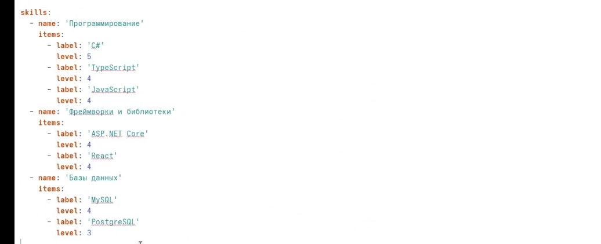
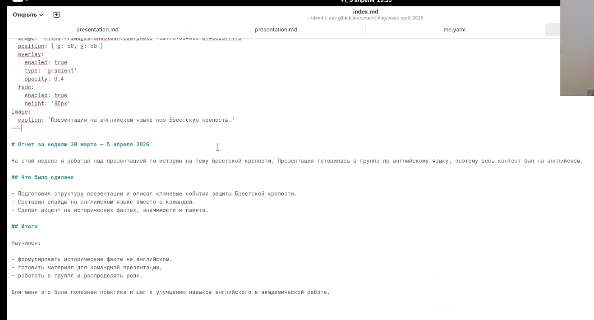
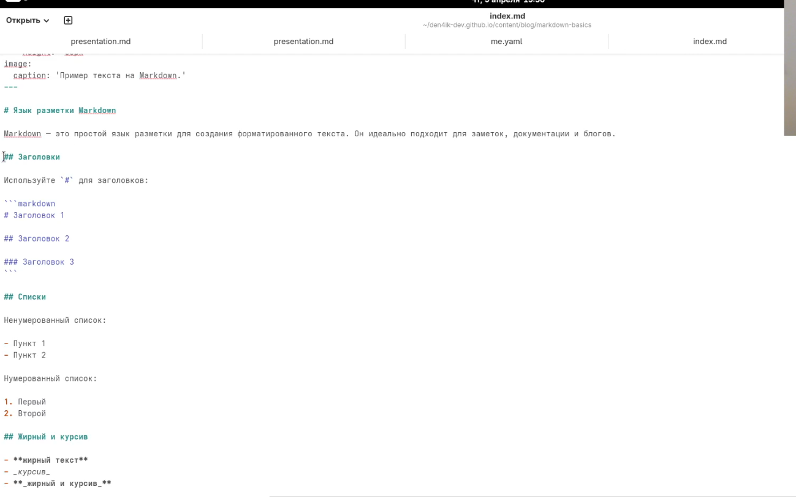
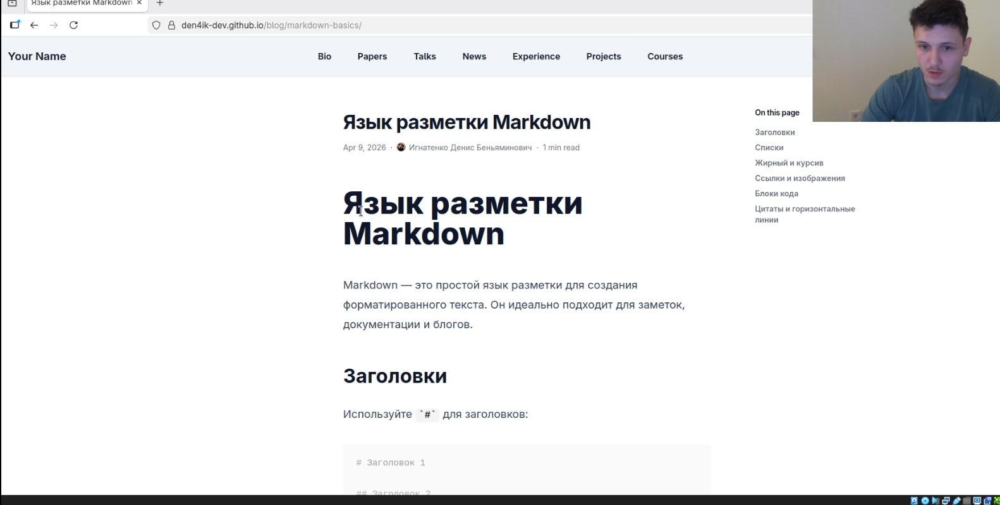
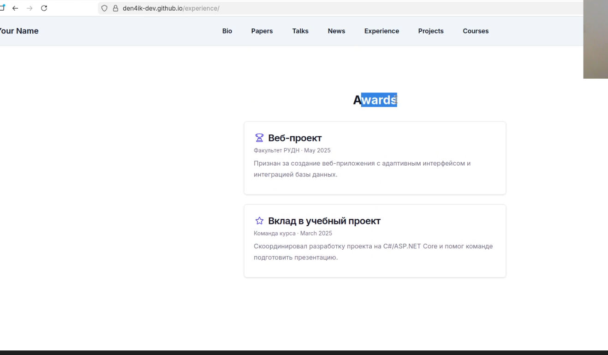

---
## Front matter
lang: ru-RU
title: Индивидуальный проект. Этап 3
subtitle: Добавление информации о себе и публикация новых материалов на персональный сайт
author:
  - Игнатенко Д. Б.
institute:
  - Российский университет дружбы народов, Москва, Россия
date: 9 апреля 2026

## i18n babel
babel-lang: russian
babel-otherlangs: english

## Formatting pdf
toc: false
toc-title: Содержание
slide_level: 2
aspectratio: 169
section-titles: true
theme: metropolis
header-includes:
  - \metroset{progressbar=frametitle,sectionpage=progressbar,numbering=fraction}
---

# Информация

## Докладчик

:::::::::::::: {.columns align=center}
::: {.column width="70%"}

- Игнатенко Денис Беньяминович
- Студент группы НПИбд-01-25
- Российский университет дружбы народов
- [1032252476@rudn.ru](mailto:1032252476@rudn.ru)

:::
::: {.column width="30%"}


:::
::::::::::::::

# Цель работы

Обновить персональный сайт, добавив в профиль автора новые данные и опубликовав два новых поста в блоге.

# Задание

- Заполнить разделы `skills`, `experience` и `awards`
- Создать пост по прошедшей неделе
- Создать пост на тему "Язык разметки Markdown"
- Проверить отображение изменений на сайте
- Опубликовать изменения через GitHub Pages

# Выполнение проекта

## Обновление профиля автора

Редактирую файл `data/authors/me.yaml` и заполняю разделы с навыками, опытом и достижениями.

{#fig:001 width=60%}

{#fig:002 width=60%}

{#fig:003 width=60%}

## Создание постов

Создаю два поста:

- `content/blog/week-april-2026/index.md`
- `content/blog/markdown-basics/index.md`

{#fig:004 width=60%}

{#fig:005 width=60%}

## Проверка на сайте

Запускаю `hugo server` и проверяю отображение страниц и разделов профиля в браузере.

{#fig:006 width=55%}

{#fig:007 width=55%}

{#fig:008 width=55%}

{#fig:009 width=55%}

{#fig:010 width=55%}

## Публикация

Фиксирую изменения и отправляю их на GitHub:

```bash
git add .
git commit -m "stage 3: add personal skills, achivments and expirience"
git push
```

# Выводы

- Профиль автора дополнен разделами `skills`, `experience` и `awards`
- Созданы два новых поста
- Сайт проверен на локальном сервере
- Изменения опубликованы на GitHub Pages
