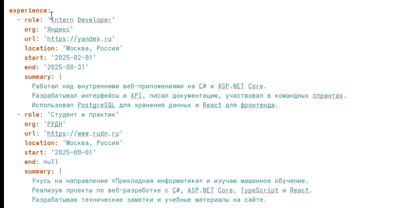
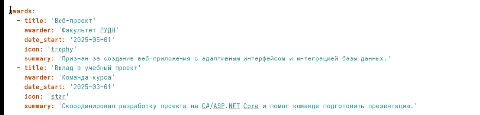
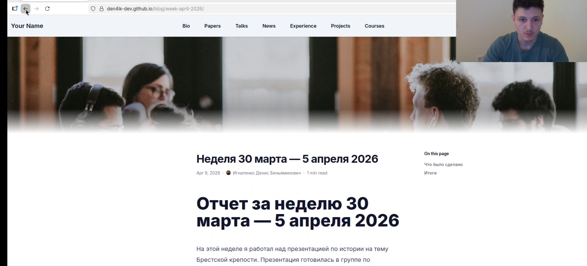
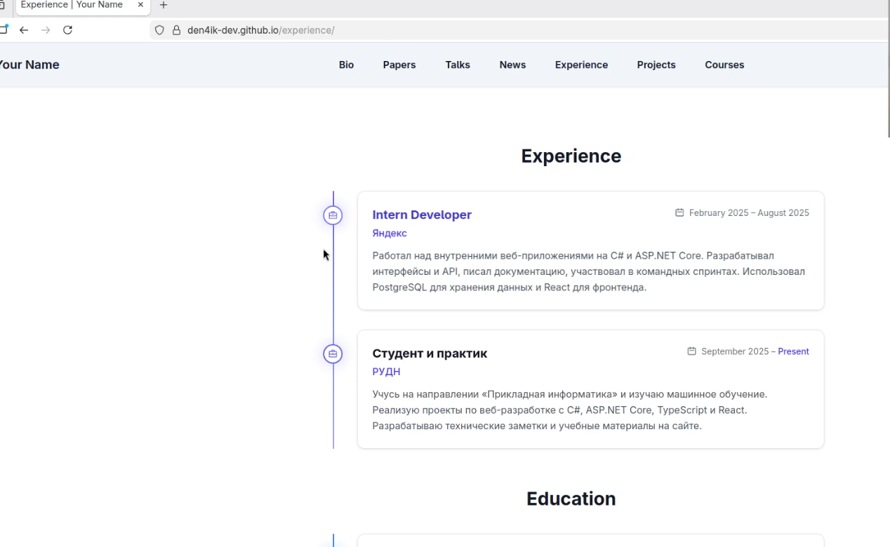
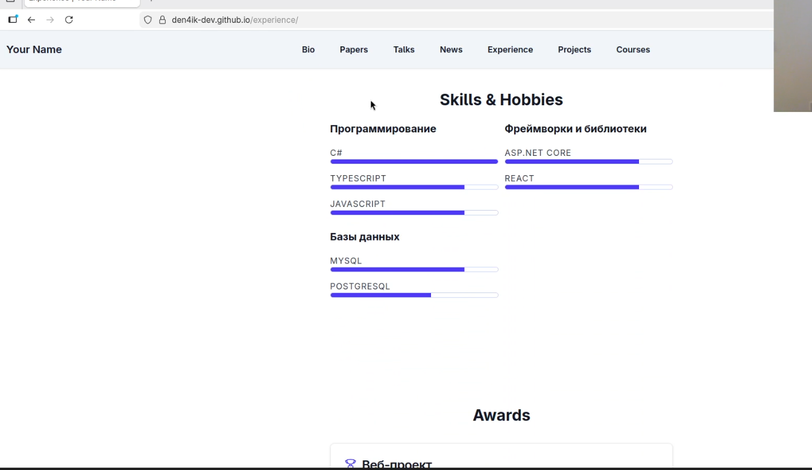

---
## Front matter
title: "Индивидуальный проект. Этап 3"
subtitle: "Добавление информации о себе и публикация новых материалов на персональном сайте"
author: "Игнатенко Денис Беньяминович"

## Generic otions
lang: ru-RU
toc-title: "Содержание"

## Bibliography
bibliography: bib/cite.bib
csl: pandoc/csl/gost-r-7-0-5-2008-numeric.csl

## Pdf output format
toc: true
toc-depth: 2
lof: true
lot: true
fontsize: 12pt
linestretch: 1.5
papersize: a4
documentclass: scrreprt
## I18n polyglossia
polyglossia-lang:
  name: russian
  options:
	- spelling=modern
	- babelshorthands=true
polyglossia-otherlangs:
  name: english
## I18n babel
babel-lang: russian
babel-otherlangs: english
## Fonts
mainfont: IBM Plex Serif
romanfont: IBM Plex Serif
sansfont: IBM Plex Sans
monofont: IBM Plex Mono
mathfont: STIX Two Math
mainfontoptions: Ligatures=Common,Ligatures=TeX,Scale=0.94
romanfontoptions: Ligatures=Common,Ligatures=TeX,Scale=0.94
sansfontoptions: Ligatures=Common,Ligatures=TeX,Scale=MatchLowercase,Scale=0.94
monofontoptions: Scale=MatchLowercase,Scale=0.94,FakeStretch=0.9
mathfontoptions:
## Biblatex
biblatex: true
biblio-style: "gost-numeric"
biblatexoptions:
  - parentracker=true
  - backend=biber
  - hyperref=auto
  - language=auto
  - autolang=other*
  - citestyle=gost-numeric
## Pandoc-crossref LaTeX customization
figureTitle: "Рис."
tableTitle: "Таблица"
listingTitle: "Листинг"
lofTitle: "Список иллюстраций"
lotTitle: "Список таблиц"
lolTitle: "Листинги"
## Misc options
indent: true
header-includes:
  - \usepackage{indentfirst}
  - \usepackage{float} # keep figures where there are in the text
  - \floatplacement{figure}{H} # keep figures where there are in the text
---

# Цель работы

Обновить персональный сайт, добавив более подробную информацию о себе в профиль автора, а также создать и опубликовать новые посты в блоге.

# Задание

- Заполнить разделы `skills`, `experience` и `awards` в файле `data/authors/me.yaml`
- Разместить новые материалы на персональном сайте
- Создать пост по прошедшей неделе
- Создать пост на тему "Язык разметки Markdown"
- Проверить отображение изменений на сайте
- Опубликовать изменения через GitHub, чтобы они автоматически развернулись на GitHub Pages

# Теоретическое введение

Персональный сайт на Hugo использует профиль автора для хранения информации о владельце сайта. Основные данные находятся в файле `data/authors/me.yaml` и могут включать имя, биографию, интересы, опыт, достижения, образование и ссылки на социальные сети.

Блог-посты в Hugo размещаются в директории `content/blog/`. Каждый пост представляет собой отдельную папку с файлом `index.md`, где содержатся метаданные (front matter) и текст статьи в формате Markdown.

В рамках этого этапа проекта я расширяю профиль автора и добавляю новые публикации, чтобы сайт содержал более полную и актуальную информацию обо мне и моих работах.

Основные элементы профиля автора представлены в таблице [-@tbl:profile].

: Элементы профиля автора {#tbl:profile}

| Элемент    | Описание                            |
| ---------- | ----------------------------------- |
| name       | Имя автора (display, given, family) |
| role       | Должность или статус                |
| bio        | Краткая биография                   |
| skills     | Список умений и технологий          |
| experience | Опыт работы, учебы или проектов     |
| awards     | Достижения и результаты             |
| education  | Информация об образовании           |
| links      | Ссылки на социальные сети           |

# Выполнение индивидуального проекта

## Заполнение умений

Открываю файл `data/authors/me.yaml` и заполняю раздел `skills` своими умениями. Вношу актуальные технологии и направления, которыми пользуюсь при разработке сайта и других проектов (рис. -@fig:001).

{#fig:001 width=70%}

## Заполнение опыта

Далее добавляю раздел `experience` и указываю свой опыт, связанный с учебой, программированием и практикой разработки (рис. -@fig:002).

{#fig:002 width=70%}

## Заполнение достижений

Затем заполняю раздел `awards`, где перечисляю свои достижения и результаты, которые можно показать в профиле автора на сайте (рис. -@fig:003).

{#fig:003 width=70%}

## Создание поста о прошедшей неделе

Создаю новый пост в директории `content/blog/week-april-2026/index.md` и описываю события прошедшей недели, чтобы регулярно вести блог и обновлять сайт (рис. -@fig:004).

{#fig:004 width=70%}

## Создание поста про Markdown

Создаю ещё один пост в директории `content/blog/markdown-basics/index.md`. В нём раскрываю тему "Язык разметки Markdown" и показываю основные возможности этого формата (рис. -@fig:005).

{#fig:005 width=70%}

## Проверка результата на локальном сервере

Запускаю локальный сервер командой `hugo server` и открываю сайт в браузере. Проверяю, что новые разделы профиля и оба поста отображаются корректно (рис. -@fig:006--fig:010).

```bash
hugo server
```

{#fig:006 width=70%}

{#fig:007 width=70%}

{#fig:008 width=70%}

{#fig:009 width=70%}

{#fig:010 width=70%}

## Публикация изменений

После проверки результата фиксирую изменения в Git, отправляю их на GitHub и жду автоматического обновления сайта на GitHub Pages.

```bash
git add .
git commit -m "stage 3: add personal skills, achivments and expirience"
git push
```

# Основные команды

Основные команды, использованные при выполнении проекта, представлены в таблице [-@tbl:commands].

: Основные команды {#tbl:commands}

| Команда                                                                   | Описание                             |
| ------------------------------------------------------------------------- | ------------------------------------ |
| `hugo server`                                                             | Запуск локального сервера разработки |
| `git add .`                                                               | Добавление всех изменений в индекс   |
| `git commit -m "stage 3: add personal skills, achivments and expirience"` | Создание коммита                     |
| `git push`                                                                | Отправка изменений на GitHub         |

# Выводы

В ходе выполнения третьего этапа индивидуального проекта я расширил профиль автора на персональном сайте: заполнил разделы `skills`, `experience` и `awards`, а также создал два новых поста — о прошедшей неделе и о языке разметки Markdown. После проверки на локальном сервере изменения были закоммичены, отправлены на GitHub и автоматически опубликованы через GitHub Pages. Сайт обновлён и содержит более полную информацию обо мне и моих материалах.

# Список литературы{.unnumbered}

::: {#refs}
:::
