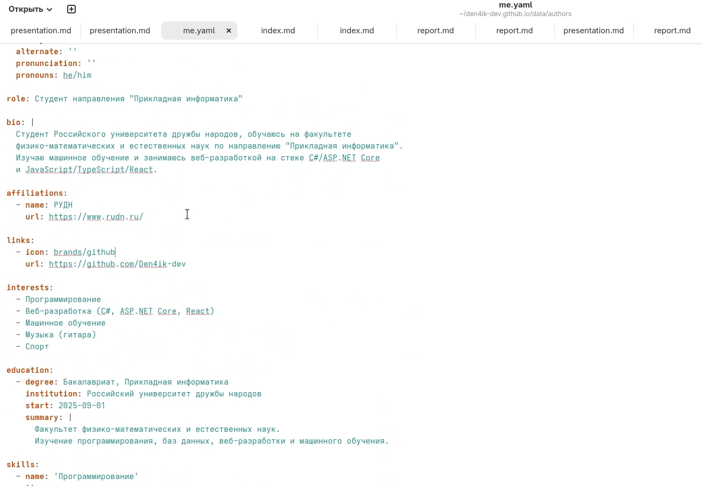
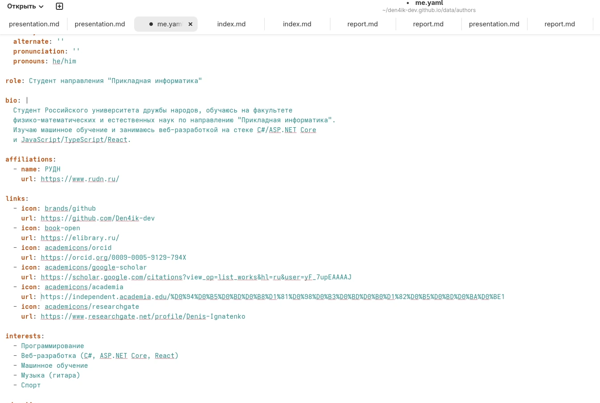
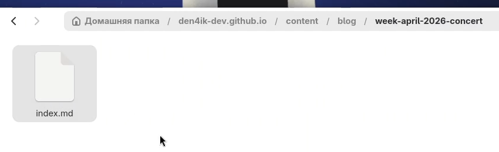
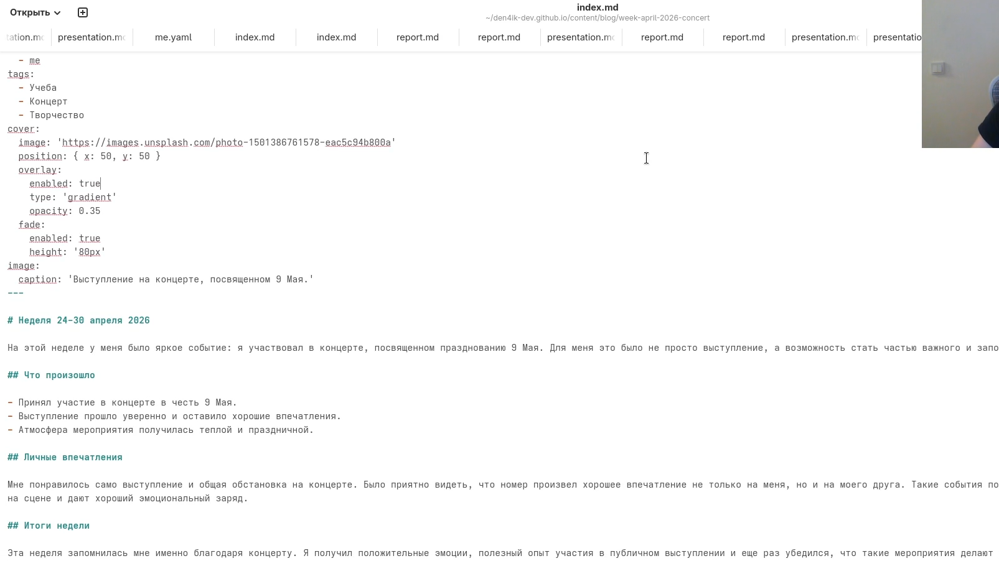
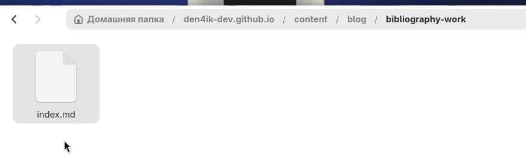
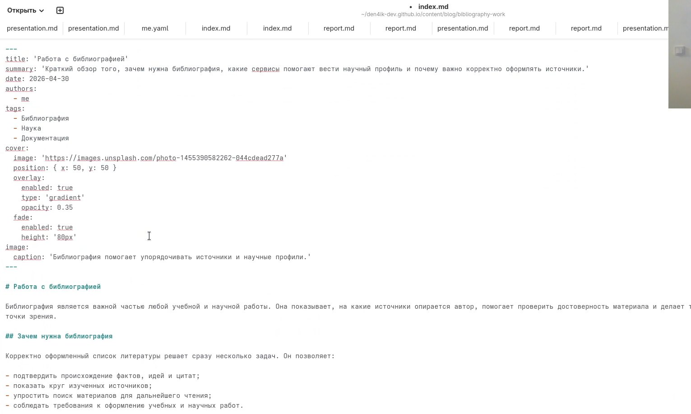
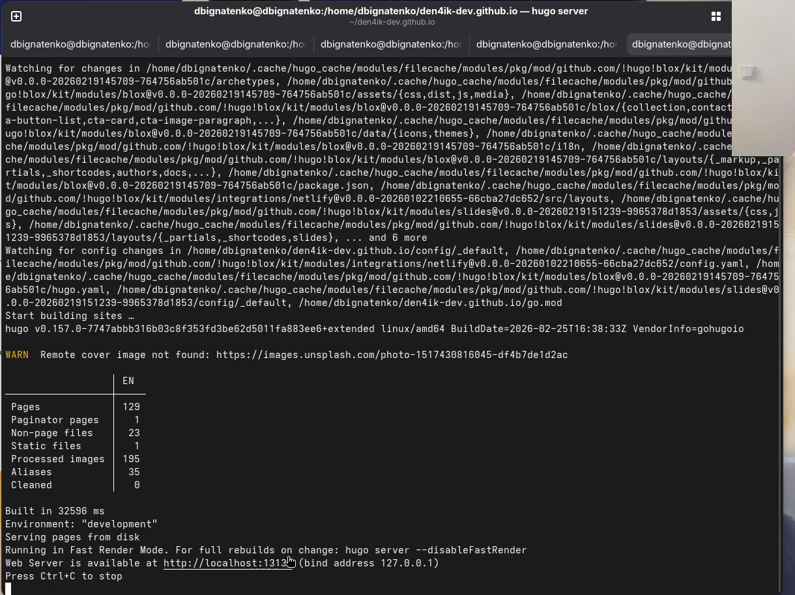
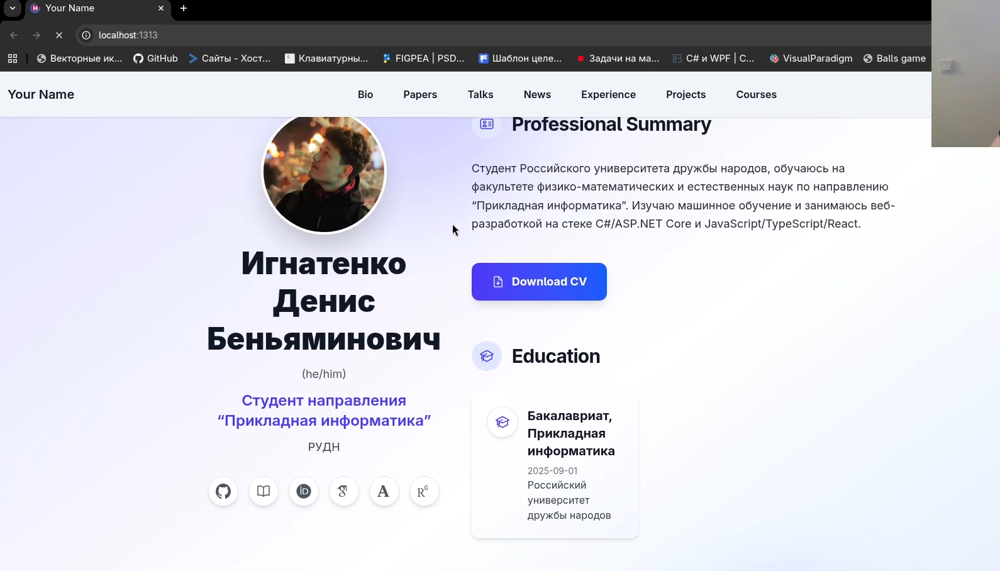
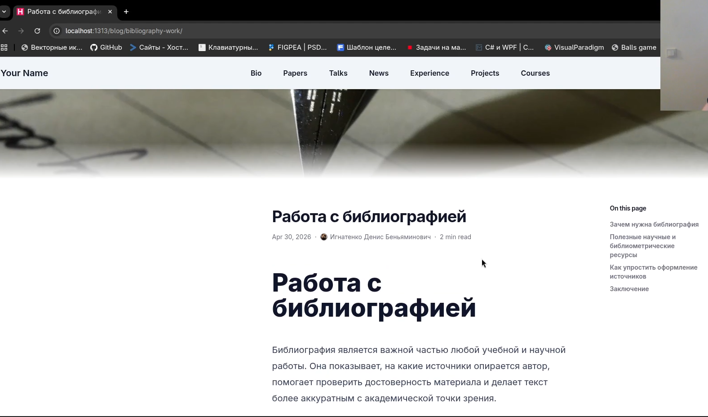
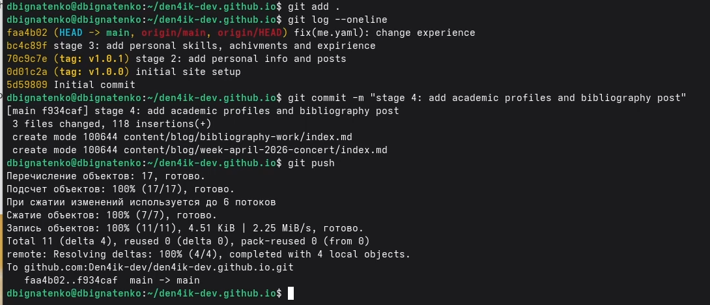

---
## Front matter
lang: ru-RU
title: Индивидуальный проект. Этап 4
subtitle: Добавление ссылок на научные и библиометрические ресурсы на персональный сайт
author:
  - Игнатенко Д. Б.
institute:
  - Российский университет дружбы народов, Москва, Россия
date: 30 апреля 2026

## i18n babel
babel-lang: russian
babel-otherlangs: english

## Formatting pdf
toc: false
toc-title: Содержание
slide_level: 2
aspectratio: 169
section-titles: true
theme: metropolis
header-includes:
  - \metroset{progressbar=frametitle,sectionpage=progressbar,numbering=fraction}
---

# Информация

## Докладчик

:::::::::::::: {.columns align=center}
::: {.column width="70%"}

- Игнатенко Денис Беньяминович
- Студент группы НПИбд-01-25
- Российский университет дружбы народов
- [1032252476@rudn.ru](mailto:1032252476@rudn.ru)

:::
::: {.column width="30%"}


:::
::::::::::::::

# Цель работы

Обновить персональный сайт, добавив в профиль автора ссылки на научные и библиометрические ресурсы, а также опубликовать два новых поста в блоге.

# Задание

- Добавить ссылки на `GitHub`, `eLibrary`, `ORCID`, `Google Scholar`, `Academia.edu`, `ResearchGate`
- Создать пост по прошедшей неделе
- Создать пост на тему "Работа с библиографией"
- Проверить отображение изменений на сайте
- Опубликовать изменения через GitHub Pages

# Выполнение проекта

## Обновление профиля автора

Редактирую файл `data/authors/me.yaml` и добавляю в блок `links` ссылки на научные и библиометрические ресурсы.

{#fig:001 width=60%}

{#fig:002 width=60%}

## Создание новых постов

Создаю два новых поста:

- `content/blog/week-april-2026-concert/index.md`
- `content/blog/bibliography-work/index.md`

{#fig:003 width=60%}

{#fig:004 width=60%}

{#fig:005 width=60%}

{#fig:006 width=60%}

## Проверка на сайте

Запускаю `hugo server` и проверяю отображение профиля и новых публикаций в браузере.

{#fig:007 width=55%}

{#fig:008 width=55%}

{#fig:009 width=55%}

{#fig:010 width=55%}

{#fig:011 width=55%}

## Публикация

Фиксирую изменения и отправляю их на GitHub:

```bash
git add .
git commit -m "stage 4: add academic profiles and bibliography post"
git push
```

# Выводы

- В профиль автора добавлены ссылки на научные и библиометрические ресурсы
- Созданы два новых поста
- Сайт проверен локально
- Изменения подготовлены для публикации на GitHub Pages
