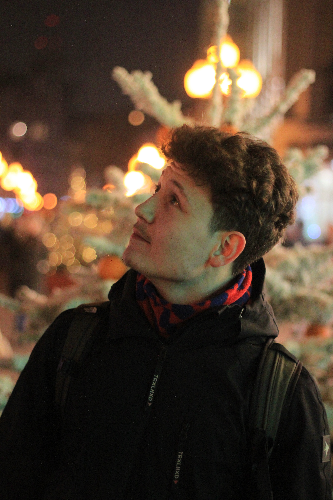
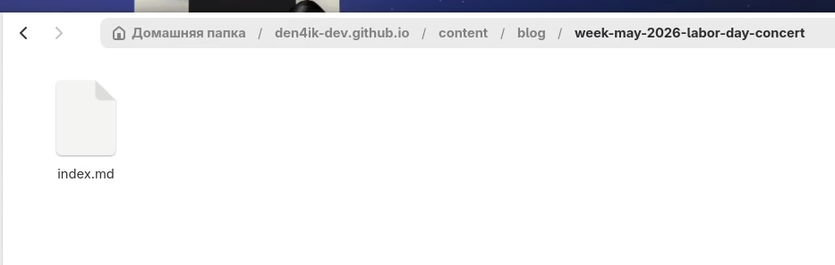
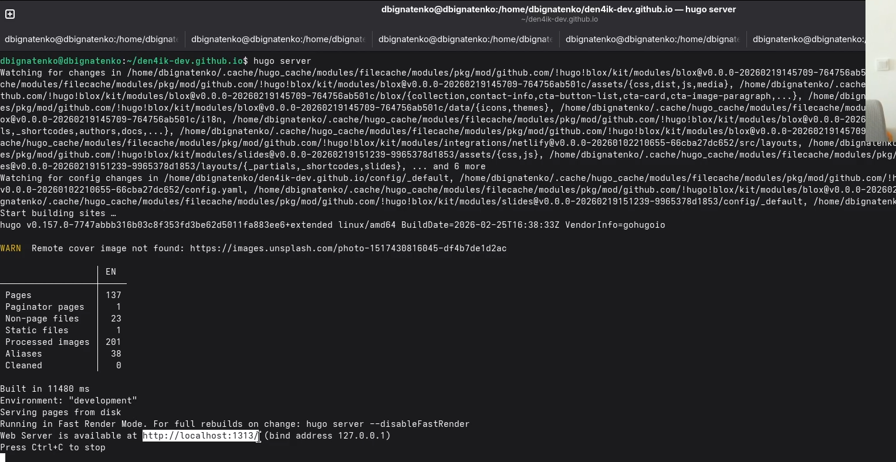
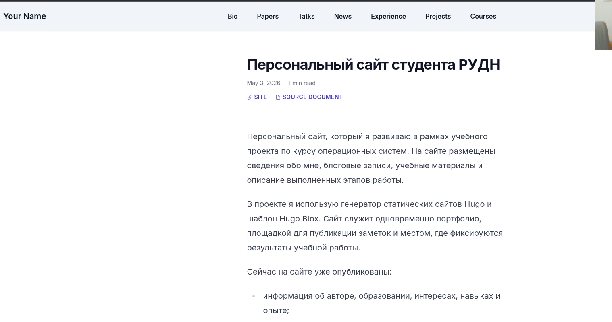
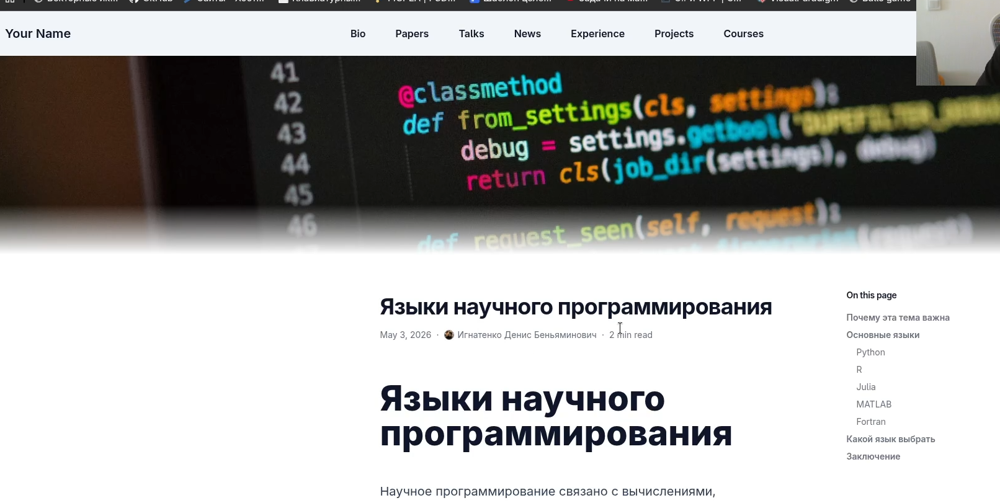

---
## Front matter
lang: ru-RU
title: Индивидуальный проект. Этап 5
subtitle: Добавление записей о персональных проектах и публикация новых материалов на персональном сайте
author:
  - Игнатенко Д. Б.
institute:
  - Российский университет дружбы народов, Москва, Россия
date: 15 мая 2026

## i18n babel
babel-lang: russian
babel-otherlangs: english

## Formatting pdf
toc: false
toc-title: Содержание
slide_level: 2
aspectratio: 169
section-titles: true
theme: metropolis
mainfont: Times New Roman
sansfont: Arial
monofont: Courier New
header-includes:
  - \metroset{progressbar=frametitle,sectionpage=progressbar,numbering=fraction}
---

# Информация

## Докладчик

:::::::::::::: {.columns align=center}
::: {.column width="70%"}

- Игнатенко Денис Беньяминович
- Студент группы НПИбд-01-25
- Российский университет дружбы народов
- [1032252476@rudn.ru](mailto:1032252476@rudn.ru)

:::
::: {.column width="30%"}



:::
::::::::::::::

# Цель работы

Обновить персональный сайт, добавив запись о персональном проекте, а также опубликовать пост по прошедшей неделе и тематический материал о языках научного программирования.

# Задание

- Создать запись для персонального проекта
- Создать пост по прошедшей неделе
- Создать тематический пост `Языки научного программирования`
- Проверить отображение материалов на сайте
- Подготовить изменения к публикации

# Выполнение проекта

## Добавление персонального проекта

Создаю новую запись проекта в `content/projects/personal-website-rudn/index.md` и описываю назначение персонального сайта.

{#fig:001 width=60%}

{#fig:002 width=60%}

## Создание weekly post

Добавляю weekly post о концерте 4 мая 2026 года в главном корпусе РУДН.

{#fig:003 width=60%}

{#fig:004 width=60%}

## Создание тематического post

Создаю пост `Языки научного программирования` и заполняю его материалом о `Python`, `R`, `Julia`, `MATLAB` и `Fortran`.

{#fig:005 width=60%}

{#fig:006 width=60%}

## Обновление раздела Projects

Корректирую текст страницы `content/projects/_index.md`, чтобы раздел был ориентирован на мои реальные проекты.

{#fig:007 width=60%}

## Проверка на сайте

Запускаю `hugo server` и проверяю отображение новых материалов в браузере.

{#fig:008 width=55%}

{#fig:009 width=55%}

{#fig:010 width=55%}

{#fig:011 width=55%}

{#fig:012 width=55%}

## Публикация

Подготавливаю изменения к публикации через Git:

```bash
git add .
git commit -m "stage 5: add project and posts"
git push
```

# Выводы

- На сайт добавлена запись о персональном проекте
- Созданы два новых поста
- Отображение материалов проверено локально
- Изменения подготовлены к публикации через GitHub Pages
