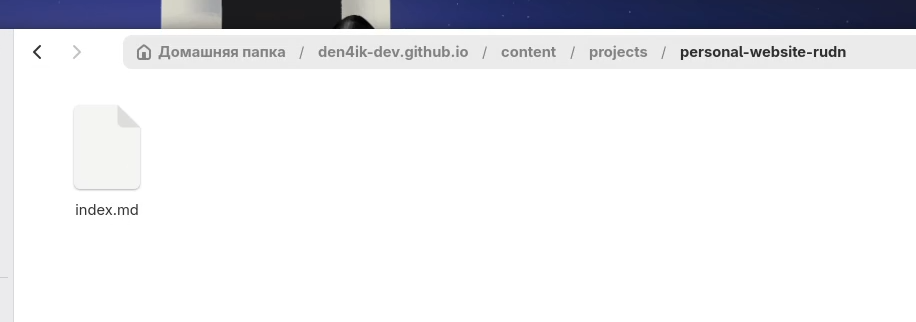
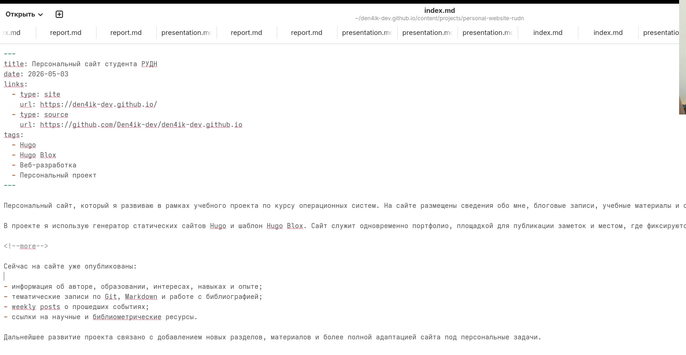
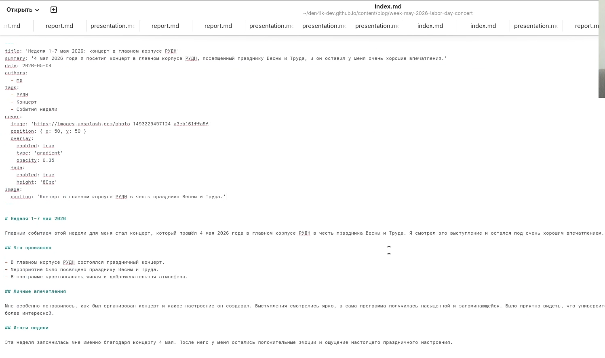
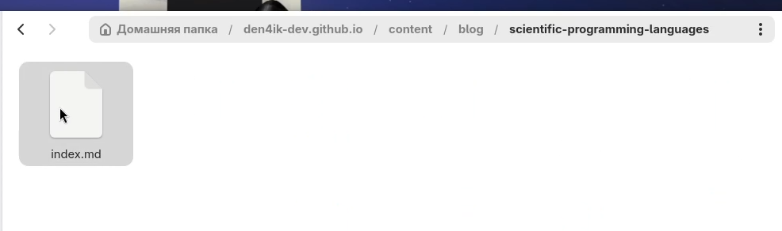
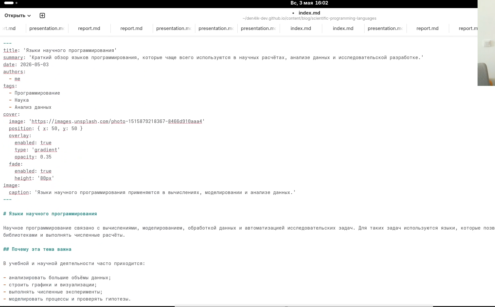
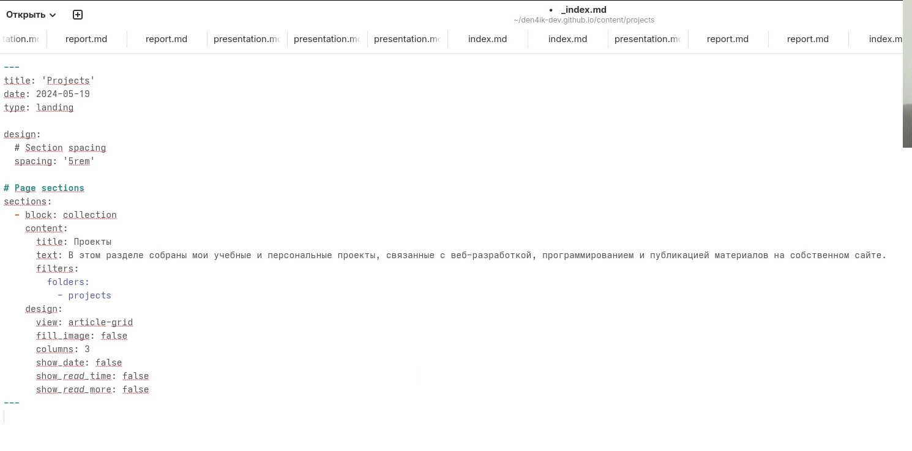
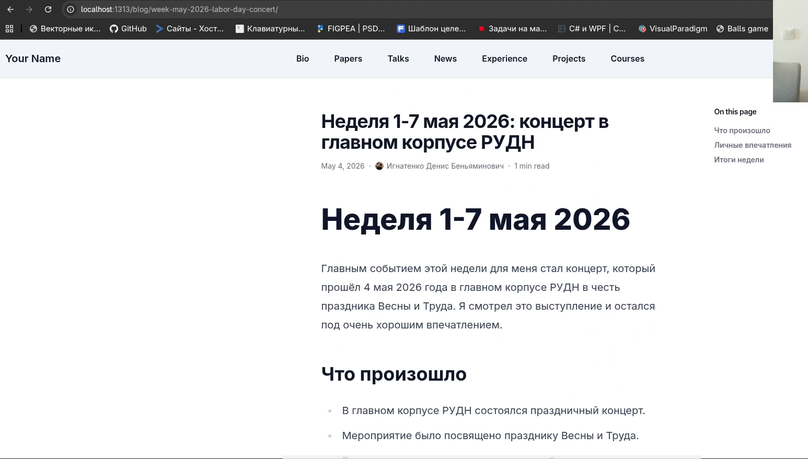
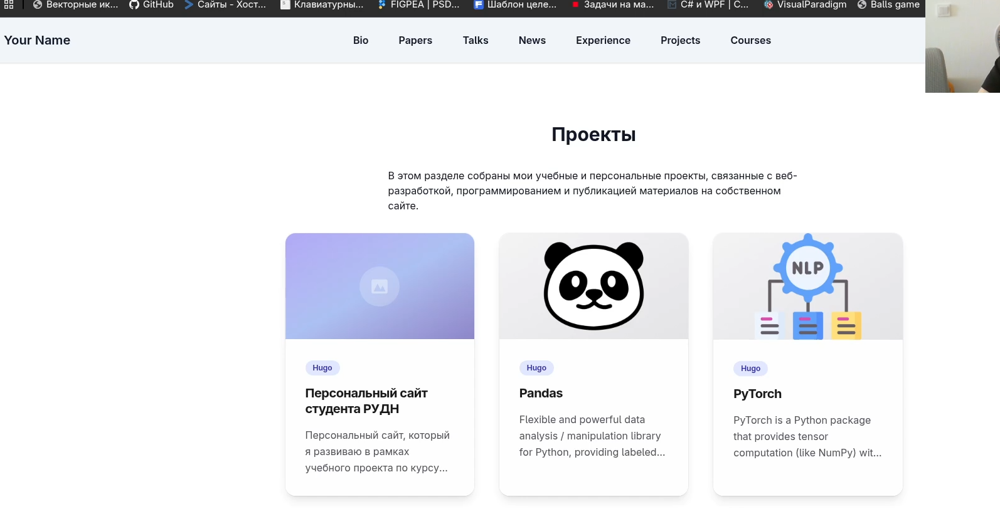

---
## Front matter
title: "Индивидуальный проект. Этап 5"
subtitle: "Добавление записей о персональных проектах и публикация новых материалов на персональном сайте"
author: "Игнатенко Денис Беньяминович"

## Generic otions
lang: ru-RU
toc-title: "Содержание"

## Bibliography
bibliography: bib/cite.bib
csl: pandoc/csl/gost-r-7-0-5-2008-numeric.csl

## Pdf output format
toc: true
toc-depth: 2
lof: true
lot: true
fontsize: 12pt
linestretch: 1.5
papersize: a4
documentclass: scrreprt
## I18n polyglossia
polyglossia-lang:
  name: russian
  options:
    - spelling=modern
    - babelshorthands=true
polyglossia-otherlangs:
  name: english
## I18n babel
babel-lang: russian
babel-otherlangs: english
## Fonts
mainfont: Times New Roman
romanfont: Times New Roman
sansfont: Arial
monofont: Courier New
mathfont: Cambria Math
mainfontoptions: Ligatures=Common,Ligatures=TeX,Scale=0.94
romanfontoptions: Ligatures=Common,Ligatures=TeX,Scale=0.94
sansfontoptions: Ligatures=Common,Ligatures=TeX,Scale=MatchLowercase,Scale=0.94
monofontoptions: Scale=MatchLowercase,Scale=0.94
mathfontoptions:
## Biblatex
biblatex: true
biblio-style: "gost-numeric"
biblatexoptions:
  - parentracker=true
  - backend=biber
  - hyperref=auto
  - language=auto
  - autolang=other*
  - citestyle=gost-numeric
## Misc options
indent: true
header-includes:
  - \usepackage{indentfirst}
  - \usepackage{float}
  - \floatplacement{figure}{H}
---

# Цель работы

Обновить персональный сайт, добавив запись о персональном проекте, а также опубликовать новые материалы: пост по прошедшей неделе и тематический пост о языках научного программирования.

# Задание

- Сделать запись для персонального проекта на сайте
- Создать пост по прошедшей неделе
- Создать пост на тему "Языки научного программирования"
- Проверить отображение изменений на сайте
- Подготовить изменения к публикации через GitHub Pages

# Теоретическое введение

Персональный сайт на Hugo позволяет размещать не только сведения об авторе и блоговые записи, но и отдельные страницы проектов. Для этого в структуре сайта используется каталог `content/projects/`, где каждая запись проекта оформляется как отдельная папка с файлом `index.md`.

Блоговые материалы размещаются в `content/blog/`. Такой подход позволяет публиковать weekly posts, тематические заметки и учебные материалы в едином формате, используя front matter и Markdown-разметку.

Добавление персональных проектов делает сайт более полезным как портфолио, а тематические публикации позволяют показать учебные интересы автора и зафиксировать результаты работы по курсу.

Основные элементы, добавляемые на сайт в рамках данного этапа, представлены в таблице 1.

Таблица 1. Материалы пятого этапа

| Элемент | Назначение |
| ------- | ---------- |
| Запись проекта | Представление персонального сайта как отдельного проекта |
| Weekly post | Фиксация события прошедшей недели |
| Тематический post | Публикация учебного материала по выбранной теме |
| Проверка на сайте | Контроль корректности отображения новых страниц |

# Выполнение индивидуального проекта

## Создание записи для персонального проекта

Сначала открываю каталог `content/projects/` и создаю новую запись проекта, посвящённую моему персональному сайту. В этой записи указываю название проекта, дату, ссылки на сам сайт и репозиторий, а также краткое описание его назначения (рис. 1).

{width=70%}

После этого заполняю содержимое файла `content/projects/personal-website-rudn/index.md`. В описании указываю, что сайт используется как персональное портфолио, площадка для публикации учебных материалов и пространство для фиксации результатов выполнения этапов проекта (рис. 2).

{width=70%}

## Создание поста по прошедшей неделе

Далее создаю новый weekly post в каталоге `content/blog/week-may-2026-labor-day-concert/index.md`. Этот материал посвящён событию прошедшей недели — концерту, который состоялся 4 мая 2026 года в главном корпусе РУДН в честь праздника Весны и Труда (рис. 3).

{width=70%}

Затем заполняю пост содержанием: добавляю заголовок, краткое описание, дату и основной текст с личными впечатлениями от концерта. В материале отмечаю, что мероприятие мне очень понравилось и оставило положительные эмоции (рис. 4).

{width=70%}

## Создание тематического поста

Следующим шагом создаю тематический пост `content/blog/scientific-programming-languages/index.md`, посвящённый языкам научного программирования. Этот материал нужен для выполнения тематической части пятого этапа (рис. 5).

{width=70%}

После создания структуры файла заполняю материал содержанием. В посте кратко рассматриваю языки `Python`, `R`, `Julia`, `MATLAB` и `Fortran`, а также поясняю, где они применяются в анализе данных, моделировании и вычислениях (рис. 6).

{width=70%}

## Обновление страницы проектов

Чтобы раздел проектов выглядел согласованно с новым содержимым, открываю страницу `content/projects/_index.md` и обновляю текст описания раздела. Теперь он ориентирован не на демонстрационные материалы шаблона, а на мои учебные и персональные проекты (рис. 7).

{width=70%}

## Проверка результата на локальном сервере

Для проверки результата запускаю локальный сервер Hugo командой `hugo server` и убеждаюсь, что сайт собирается и доступен в браузере (рис. 8).

```bash
hugo server
```

{width=70%}

После запуска сначала открываю страницу нового проекта и убеждаюсь, что она корректно отображается в разделе `Projects` и содержит нужные сведения о сайте (рис. 9).

{width=70%}

Затем проверяю weekly post о концерте в главном корпусе РУДН. Страница открывается корректно, заголовок, дата и основной текст отображаются без ошибок (рис. 10).

{width=70%}

После этого открываю тематический пост `Языки научного программирования` и убеждаюсь, что материал отображается корректно и присутствует в блоге среди других публикаций (рис. 11).

{width=70%}

В завершение проверяю итоговое состояние раздела `Projects` или общего списка новых материалов на сайте, чтобы убедиться, что изменения действительно добавлены в структуру сайта и доступны для просмотра (рис. 12).

{width=70%}

## Публикация изменений

После проверки результата подготавливаю изменения к публикации через Git. Для этого добавляю новые и изменённые файлы в индекс, создаю коммит и отправляю изменения в удалённый репозиторий GitHub, после чего сайт может быть автоматически обновлён через GitHub Pages.

```bash
git add .
git commit -m "stage 5: add personal project and scientific programming post"
git push
```

# Основные команды

Основные команды, использованные при выполнении проекта, представлены в таблице 2.

Таблица 2. Основные команды

| Команда | Описание |
| ------- | -------- |
| `hugo server` | Запуск локального сервера разработки |
| `git add .` | Добавление изменений в индекс |
| `git commit -m "stage 5: add personal project and scientific programming post"` | Создание коммита |
| `git push` | Отправка изменений на GitHub |

# Выводы

В ходе выполнения пятого этапа индивидуального проекта я добавил на персональный сайт запись о собственном проекте, посвящённом этому же сайту, а также создал два новых поста: weekly post о концерте 4 мая 2026 года в главном корпусе РУДН и тематический материал о языках научного программирования. После проверки на локальном сервере изменения были подготовлены к публикации через GitHub Pages. Сайт стал содержать больше персональных материалов и лучше отражать мои учебные интересы и проекты.

# Список литературы{.unnumbered}

::: {#refs}
:::
